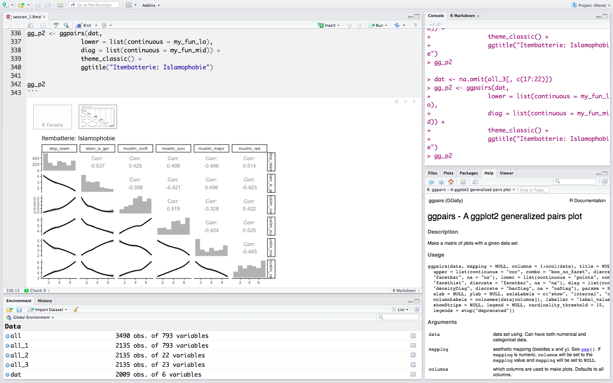

Die R-Group bietet einen R-Einführungsworkshop für SozialwissenschaftlerInnen an. Auf der Agenda stehen statistische Konzepte (z.B. Lineare Regression) und deren einfache Umsetzung in R. 

## Termin?
* **Wann?** 12.05.2017, 9 bis 16 Uhr
* **Wo?** Seidenstraße 36, M36.2 (CIP-Pool)

<a href="https://goo.gl/forms/aY2JU4avq54XYynV2" 
style="background-color:#2273ec;border-radius:px;color:#ffffff;display:inline-block;font-family:sans-serif;font-size:20px;font-weight:bold;line-height:50px;text-align:center;text-decoration:none;width:200px;-webkit-text-size-adjust:none;">Hier Anmelden</a>

## Was ist R?

`R` ist eine leistungsfähige und vielseitige Statistik-Software, die in Wirtschaft und Forschung zunehmend an Bedeutung gewinnt. In Kombination mit `RStudio` wird Datenbearbeitung einfach und übersichtlich, aber zugleich 100% flexibel gehalten.

## Warum R?

Im Gegensatz zu SPSS und STATA ist R komplett **kostenlos**. Die Open Source Community entwickelt ständig neue, frei verfügbare R Packages und stellt Innovationen aus Forschung und Entwicklung zeitnah und komplett kostenlos zur Verfügung. Die grafische Benutzeroberfläche RStudio macht die Verarbeitung von Datensätzen mit R effizienter und einfacher als jemals zuvor. 

## Voraussetzungen

* **KEINE** Programmier oder R-Erfahrung 
* Statistik-Beginner
* ein eigener Laptop wäre von Vorteil (aber nicht zwingend).

## Wer sind wir?

Die R Group wird von einigen Masterstudenten der Universität Stuttgart selbst organisiert. Wir treffen uns 
zweimal monatlich, ein Termin für Beginner und ein weiterer mit fortgeschrittenen Themen. Der erste Termin (18.05) nach dem Workshop wird ein Beginner-Treffen sein. 

## Termine der R-Group

- **12.05.2017**: *Einführungsworkshop für R*. Simon Roth.

(Stand 02.05.)

- **18.05.2017**: *Reproduciable research*. Die Formate `RMarkdown` und $\LaTeX$ sind wichtig für eine robuste und nachvollziebare Dokumentation wenn man mit Daten arbeitet. Rebecca Litauer wird diese einfachen aber mächtigen Formate vorstellen und einige templates zum sofortigen Durchstarten bereitstellen. Perfekt für Hausarbeiten und Reports. 

- **01.06.2017**: *Multi-level Regression and Viszualization*. Daten welche unterschieldiche Kontexte (z.B. Länder, Schulen, Zeitpunkte) beinhalten, weisen je nach Gruppe variierende Effekte auf. Die Struktur der Daten erfodert eine Multi-Level Regression, welche die Heterogenität zwischen den Gruppen berücksichtigt. Fabio Votta.

- **15.06.2017**: noch offen
- **29.06.2017**: noch offen
- **13.07.2017**: Summer of Code: Kaggle Competition: Practice real data science. 

## Weitere Ideen: 

Wir würden uns freuen wenn Dozenten und Studierende aus verschiedenen Bereichen ihre
Themen und Konzepte in der R-Group vorstellen. Weitere Themenvorschläge sind bisher:

* GGplot2/ Tidyuniverse
* Logistische Regression
* Machine Learning 
* Text Mining
* Imputation
* Bayesian Modeling
* Github.io

## Kontakt

[R Group Stuttgart auf Facebook](https://www.facebook.com/groups/rstuttgart/)

[R Group Homepage](r-group-stuttgart.github.io)

