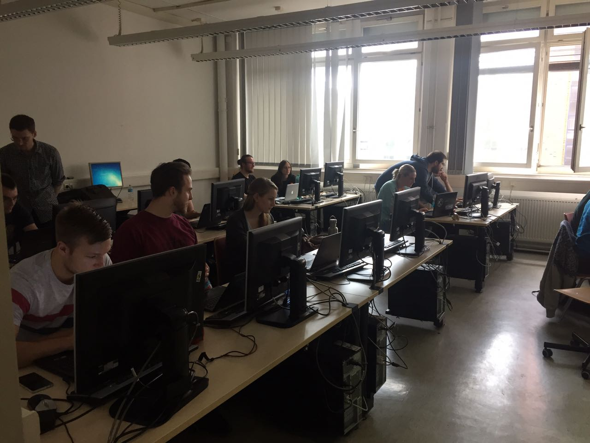
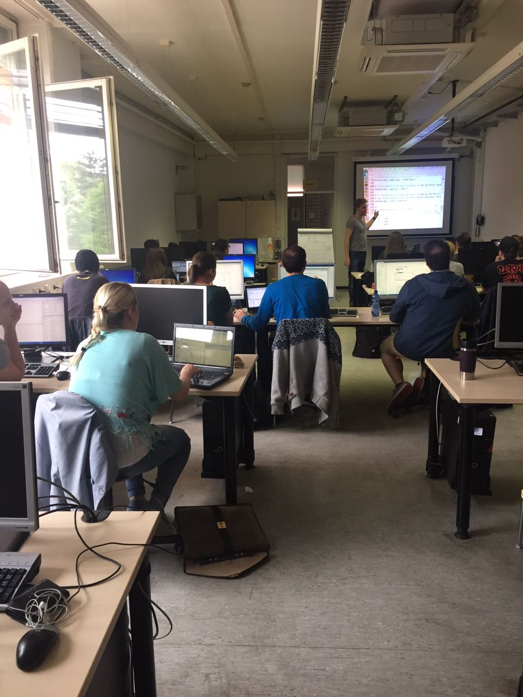
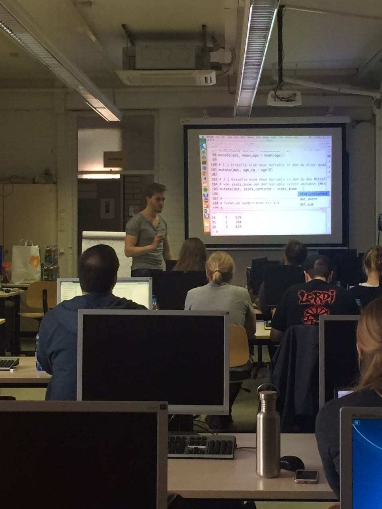

Am 12.05.2017 hat die R-Group Stuttgart einen ganztägigen Workshop angeboten um die Statistiksoftware R zu erlernen. Der Workshop ging von 9-16:30 Uhr und es
nahmen insgesamt 25 Studierende aus verschiedenen Fachrichtungen teil. Ziel des Workshops war es, gerade auch Personen kommend von SPSS von der Einfachheit und Mächtigkeit von R zu überzeugen. Folgende Themen standen auf dem Programm:

1. R Basics
2. Datenmanipulation mit `dplyr`
3. Visualisierungen mit `sjPlot`
4. Lineare Regression und deren grafische und tabellarische Darstellung. 

Der Workshop hatte teilweise theorielastige Parts, wie z.B. Lineare Regression allerdings  wurde viel Wert darauf gelegt, dass die TeilnehmerInnen selbst genügend programmieren. Dazu wurden im Vorfeld Skripte erstellt, die jeweils mit Code-Beispielen und Übungsaufgaben versehen waren. Neben den verwendeten R-Skripten wurde ein online "Buch" mit ausführlichen Erklärungen, Tipps und Tricks bereit gestellt, dass sich direkt auf den Verlauf des Workshops bezieht. Das [Book](https://systats.github.io/learn_R/) steht auch weiterhin zur Verfügung und soll in Zukunft weiterentwickelt werden. 

Um die Motivation und Aufnahmefähigkeit zu steigern wurden Getränke und Snacks im 
Wert von 100€ für die TeilnehmerInnen zur Verfügung gestellt. Das "GESIS-Feeling" sorgte für eine deutlich gehobenere Stimmung und längere Konzentrationsphasen. 

Ein paar Eindrücke:

<center>

<br>


</center>


# Feedback

1. Simme überhaupt nicht zu/ Sehr schlecht
5. Stimme voll und ganz zu

```{r, echo = F, message=F, error=F, warning=F}
library(ggplot2)
suppressMessages(library(dplyr, warn.conflicts = FALSE, quietly=TRUE))
library(googlesheets)
library(tidyr)
library(ggthemes)
id <- gs_title("feedback_workshop")
feedback_workshop <- gs_read(id) #ws = "long_data"

nn <- feedback_workshop%>% 
  select(Timestamp, contains("Bitte ")) %>%
  gather("item", "score", -Timestamp) %>%
  mutate(item = stringr::str_extract(item, "\\[.*?\\]"))
```


```{r, fig.width = 7, fig.height = 10, echo = F, message=F, error=F, warning=F}
nn %>%
  ggplot(aes(score, fill = item)) +
  geom_bar(alpha = .7) +
  facet_wrap(~item, nrow = 3) +
  ggthemes::theme_hc() +
  scale_fill_hc() +
  theme(legend.position = "none") 
```


