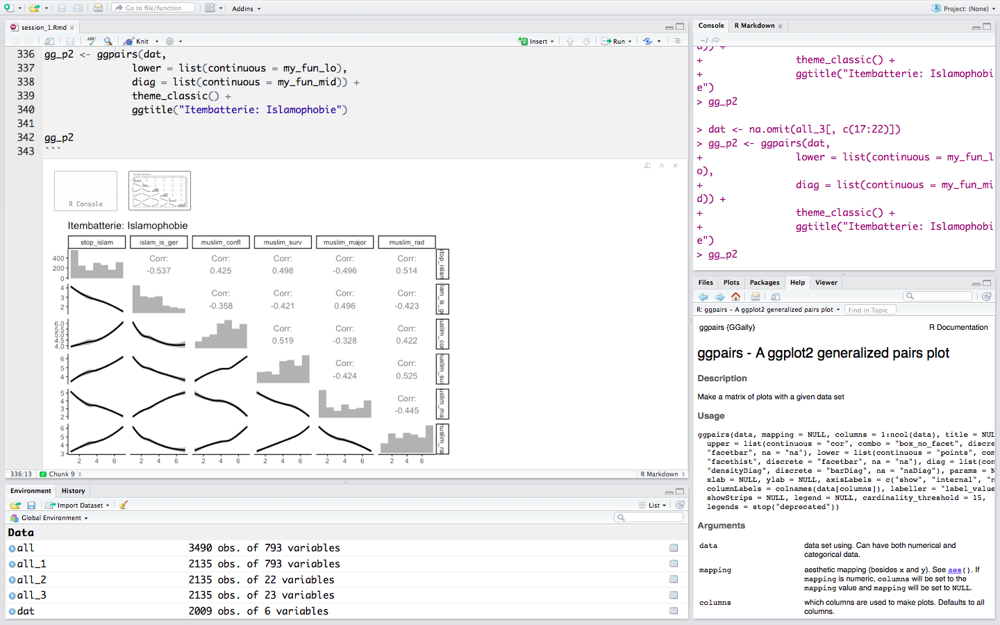

```{r setup, include=FALSE}
knitr::opts_chunk$set(#echo = T # Whether to display code along with its results
                      #, eval = T # Whether to evaluate the code and include its results
                      results = "hide" # this at deafult is in end much more efficient
                      , cache = F # Whether to cache results for future renders (efficient!)
                      , warning = F # Whether to display errors
                      , message = F # Whether to display messages
                      , error = F # mybe turn on
                      , tidy = F # Whether to reformat code in a tidy way when displaying it
                      #, root.dir = normalizePath('/Users/simonroth/Dropbox/methods/git/tidy_textmining/my_summary/') 
                      #, root.dir = normalizePath("E:/Dropbox/methods/git/tidy_textmining")
                      # in order to calculate relative paths
                      , fig.width = 6
                      , fig.height = 4
                      , fig.align = "center"
                      )
```

## Was ist R? {data-transition="fade"}

* Statistik-Software 
* kostenlos 
* mächtig!




## Warum R? Beliebtheit
```{r, echo = F, eval = F}
# devtools::install_github("PMassicotte/gtrendsR")
library(gtrendsR)
dat_w <- gtrends(c("R", "SPSS", "SAS", "Stata"), time = "all") 
dat_w_time <- dat_w$interest_over_time
dat_w_geo <- dat_w$interest_by_region
dat_w_city <- dat_w$interest_by_city


unique(gtrendsR::countries[, "country_code"])
dat_g <- gtrends(c("R", "SPSS", "SAS", "Stata"), geo = "DE", time = "all") 
dat_g_time  <- dat_g$interest_over_time

head(dat_w_time)
head(dat_g_time)

dat_time <- rbind(dat_g_time, dat_w_time)

#save(dat_time, file = "softwares_time.Rdata")
#save(dat_w_geo, file = "softwares_geo.Rdata")
#save(dat_w_city, file = "softwares_city.Rdata")
```


```{r pl, eval = T, echo = F, plotly = T, fig.width = 10, fig.height = 5, results='asis'}
load("softwares_time.Rdata")

library(dplyr)
library(ggplot2)

dat_time %>%
  ggplot(aes(date, hits, colour = keyword)) + 
    geom_line(alpha = 0.5) +
    geom_smooth(se=F) +
    facet_wrap(~ geo, ncol = 2) + 
    ggthemes::scale_color_gdocs() +
    #tidyquant::scale_color_tq() +
    tidyquant::theme_tq() +
    labs(x = "", y = "Google's popularity index")

# library(plotly)
# devtools::install_github('ropensci/plotly')
# ggplotly(gg1)
```
<font size=4>
Note: Numbers represent search interest relative to the highest point on the
chart for the given region and time. A value of 100 is the peak popularity for
the term. A value of 50 means that the term is half as popular. Likewise a score
of 0 means the term was less than 1% as popular as the peak [Google Trends](https://trends.google.com/trends/).
</font>


## Warum R? Über 10.000 Packages! {data-transition="convex"}

```{r, echo = F, eval = T, results = 'asis', fig.width = 8, fig.height = 5, plotly = T, fig.align = "center"}
# dir()
load("packages_cran_9apr17.Rdata")

tab1 %>%
  group_by(my) %>%
  summarise(n = n()) %>%
  mutate(csum = cumsum(n)) %>%
  #tally %>%
  ggplot() +
    geom_point(aes(my, csum), size = 1) +
    geom_bar(aes(my, n), stat = "identity") + 
    theme_bw() + 
    labs(x = "", y = "Numbers of Monthly Published Packages")

# library(plotly)
# ggplotly(pack_time)
```


## Warum R? Visualisierungen

<!-- $$ f(x) = \frac{1}{\sigma \sqrt{2\pi }} e^{-\frac{1}{2}\left(\frac{x-\mu }{\sigma }\right)^{2}}$$ -->
<!-- $$ x \backsim Normal(\mu,\sigma)$$ -->

```{r, echo = F}

n <- 200
normally_distributed <- rnorm(n, mean = 0, sd = 1)
normally_dist <- data.frame(id = 1:length(n), normally_distributed)


prob_under_minus1 <- pnorm(q = -1, mean = 0, sd = 1)
prob_over_1 <-  1 - pnorm(q = 1, mean = 0, sd = 1)
between_prob <- 1 - (prob_under_minus1 + prob_over_1)  

norm_frame = with(density(normally_distributed),  # Create data frame density values
                  data.frame(x,y))  

library(ggplot2)
library(ggthemes)
norm_dens <- function(dat) {
    mi <- min(dat$value)
    ma <- max(dat$value)
    grid <- seq(mi, ma, by = .1)
    return(data.frame( 
    predicted = grid,
    density = dnorm(grid, mean(dat$value), sd(dat$value))
    ))
}

library(dplyr)
normaldens <- normally_dist %>%
  rename(value = normally_distributed) %>%
  #group_by(var, miss) %>%
  do(norm_dens(.))

myplot <- ggplot(data = norm_frame, aes(x = x, y = y)) +   # Create the plot
       geom_line() +
       theme_bw() +
      geom_line(data = normaldens, 
              aes(x = predicted, y = density), colour = c("#6A5ACD"), size = 1) + 
       geom_ribbon(data=subset(norm_frame,x < -1),
                   aes(ymax=y),
                   ymin=0,
                   fill="#B22222", 
                   alpha=0.4) +
       geom_ribbon(data=subset(norm_frame,x > 1),
                   aes(ymax=y),
                   ymin=0,
                   fill=c("#B22222"), 
                   alpha=0.4) +
       geom_ribbon(data=subset(norm_frame,x > -1 & x < 1),
                   aes(ymax=y),
                   ymin=0,
                   fill=c("#6495ED"), 
                   alpha=0.4) +
       geom_text(x=-1.6,y=0.03,label=paste0(round(prob_under_minus1,3)*100, "%"),size=4) +
       geom_text(x=1.6,y=0.03,label=paste0(round(prob_under_minus1, 3)*100, "%"), size=4) +
       geom_text(x=0,y=0.1,label=paste0(round(1-(prob_under_minus1*2), 3)*100, "%"), size=5) +
       xlim(-4,4) +
       geom_vline(xintercept = sd(norm_frame$x)*1, linetype = 2) + 
       geom_vline(xintercept = sd(norm_frame$x)*-1, linetype = 2) +
       geom_vline(xintercept = mean(norm_frame$x), linetype = 2) 

myplot

```

## Warum R? Kosten

| Statistical Package | Base           | Standard                   | Pro                              | Professional                             | Source                                                                               |
|---------------------|----------------|----------------------------|----------------------------------|------------------------------------------|--------------------------------------------------------------------------------------|
|  | $1210/y   * LM | $2690/y   * GLM * Logistic | $5400/y   * Regularization * PCA | $8050/y * Time Series * Machine Learning | [IBM](https://www.ibm.com/us-en/marketplace/spss-statistics/purchase#product-header) |
|                  | $8000/y        |                            |                                  |                                          | [Quora](https://www.quora.com/How-much-does-SAS-cost)                                |
|                | $595/y $1195   | $845/y $1695               | $6,445  Server Version           |                                          | [Stata](http://www.stata.com/order/new/bus/single-user-licenses/)                    |
|                  | free           | free                       | free                           | free                                     | [RStudio](https://www.rstudio.com/pricing/)                                          |


## {data-transition="zoom"}


## Infos {data-transition="zoom"}

* **KEINE** Programmier oder R-Erfahrung 
* Statistik-Beginner
* ein eigener Laptop wäre von Vorteil (aber nicht zwingend).

* **Wann?** 12.05.2017, 9 bis 16 Uhr
* **Wo?** Seidenstraße 36, M36.2 (CIP-Pool)


## Kontakt

[R Group Stuttgart auf Facebook](https://www.facebook.com/groups/rstuttgart/)

[R Group Homepage](r-group-stuttgart.github.io)


