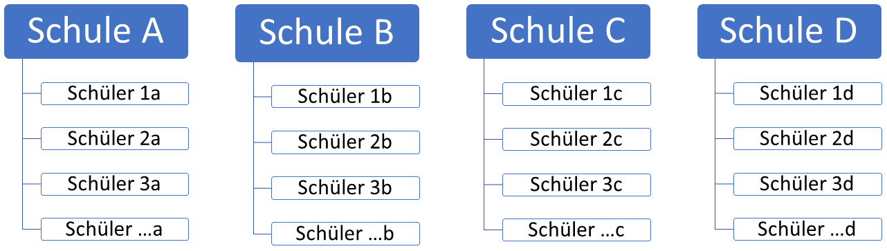
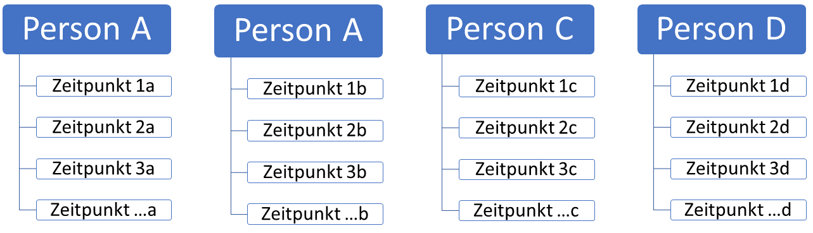
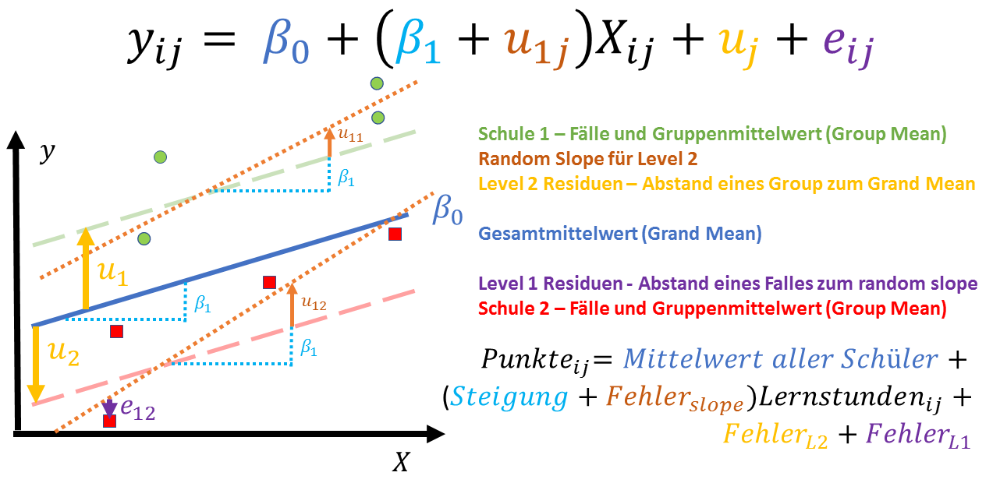
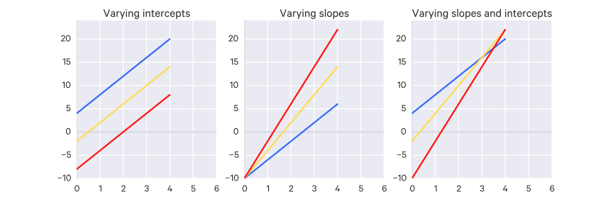

```{r setup, include=FALSE}
knitr::opts_chunk$set(echo = T 
                      , eval = T 
                      , results = "hide" 
                      , cache = F 
                      , warning = F 
                      , message = F 
                      , tidy = T 
                      , error=F)
```

# Einf?hrung
```{r packages, echo=FALSE, results="hide"}
#install.packages("") # Lade Packages die du brauchen wirst runter, dies muss nur einmalig geschehen
needed.packages <- c("ggplot2","ggthemes", "stargazer", "plyr", "texreg", "gdata", "knitr", "xlsx", "sjPlot", "sjmisc", "xtable", "texreg", "dplyr") # packages werden geladen, geht auch über library()
lapply(needed.packages, require, character.only = TRUE)
library(lme4)
library(sjstats)
library(ggplot2)
library(sjmisc)
library(sjPlot)
library(stargazer)
```

Der Workshop vermittelt die theoretischen Grundlagen von Multilevel-Modellierung sowie wichtige methodische und statistische Anwendungen. Ziel ist es zu lernen wie man Datens?tze mit hierarchischen Strukturen mit R  analysiert, die Ausgabe interpretiert und die Ergebnisse in sch?nen Tabellen pr?sentiert.


# Datenstrukturen

Multilevel-Modelle (manchmal auch: hierarchical linear models, mixed models, random effects models oder variance components models) eignen sich um Daten zu analysieren, welche eine hierarchische Struktur aufweisen. In einer hierarchischen Datenstruktur k?nnen wir Einheiten identifizieren welche in weitere Einheiten gruppiert sind. Oft, aber nicht immer, sind diese Untereinheiten einzelne Individuen. Einzelpersonen werden dann in ?bergeordnete Einheiten gruppiert, zum Beispiel Schulen, Firmen, L?nder usw. Statt *gruppieren* spricht man auch von F?llen welche in einem gewissen Kontext *genested* sind. Man sagt dann, dass sich Sch?ler/Arbeiter/B?rger auf _Level 1_ und die Schulen/Firmen/L?nder auf _Level 2_ unserer Datenstruktur befinden.



Das Prinzip von genesteden Einheiten folgt dem exakt selben Prinzip f?r mehrere Zeitpunkte, welche in einem Individuum genested sind.



Die folgende Tabelle soll die Daten verst?ndlicher machen. So zeigen die ersten beiden Reihen der Tabelle die angenommene hierarchische Datenstruktur (Level 1 = die Sch?ler und Level 2 = die Schulen). Typischerweise wird Level 1 mit einem $i$ notiert w?hrend Level 2 Einheiten mit einem $j$ ausgestattet werden. Darauf folgend werden die Punktzahl der Sch?ler f?r einen Test (0-100) eingetragen, welche als m?gliche abh?ngige Variable gesehen werden kann. Die Notierung $ij$ beschreibt dabei die Punktzahl eines Sch?ler $i$ in der Schule $j$. Im Anschluss befinden sich drei Pr?diktor-/Erkl?rungs-/x-Variablen: die Punktzahl der Sch?ler in einer vorherigen Klausur, das Geschlecht des Sch?lers sowie ob die Schule staatlich oder privat finanziert ist. Die letzte Variable ist insofern besonders, als dass sie eine *Level 2 Variable* darstellt, eine Variable welche sich nur auf die spezielle Auspr?gung der Schule bezieht (und nicht auf die individuellen Sch?ler). 

| Sch?ler i | Schule j | Punkte ij | Vorherige Punkte ij | Geschlecht ij | Schultyp  j |
|:---------:|:--------:|:---------:|:-------------------:|:-------------:|:-----------:|
|     1a    |     A    |     75    |          56         |       W       |    Staat    |
|     2a    |     A    |     71    |          45         |       M       |    Staat    |
|     3a    |     A    |     25    |          56         |       M       |    Staat    |
|     1b    |     B    |     91    |          72         |       W       |    Staat    |
|     2b    |     B    |     68    |          49         |       W       |    Staat    |
|     3b    |     B    |     91    |          72         |       W       |    Staat    |
|     1c    |     C    |     37    |          36         |       M       |    Privat   |
|     2c    |     C    |     61    |          56         |       M       |    Privat   |
|     3c    |     C    |     33    |          16         |       M       |    Privat   |
|     1d    |     D    |     33    |          76         |       W       |    Privat   |
|     2d    |     D    |     62    |          56         |       M       |    Privat   |
|     3d    |     D    |     31    |          36         |       M       |    Privat   |

Wieviele F?lle braucht man pro Einheit?

Generell sagt man 25 Gruppen.[1] Aber es kommt auch ganz darauf an was genau einen interessiert. Wenn vor allem Individuen und deren Unterschiede untereinander interessieren und man viele F?lle pro Schule hat (z.B 1000 F?lle pro Schule) dann kann man testdatalemlos gute Ergebnisse f?r seine Multilevelregression erhalten. Sollte man sich allerdings vor allem auf die 2. Ebene und die Unterschiede zwischen Schulen interessieren dann sollte man auch eine gewisse Mindestanzahl an F?llen auf der 2. Ebene haben (25-100).

|                                                                 Methode                                                                |                                                                                                                               Konsequenzen                                                                                                                              |
|:--------------------------------------------------------------------------------------------------------------------------------------:|:-----------------------------------------------------------------------------------------------------------------------------------------------------------------------------------------------------------------------------------------------------------------------:|
|                                 Normale OLS Regression und ignorieren der hierarchischen Datenstruktur                                 | Der Einfluss des Kontextes wird ignoriert. Der Standardfehler wird zu gering gesch?tzt, was zu falschen Schlussfolgerungen f?hrt (also dass Effekte welche eigentlich signifkant werden w?rden, nicht als solche erkannt werden d.h. ein hohes Risiko f?r Typ-I-Fehler). |
|                              Modell mit Dummy-Variablen f?r die jeweiligen Gruppen (Fixed-Effects-Modell)                              |  Gruppe wird als feste Klassifikation behandelt, so dass das die Schlussfolgerung der Analyse auf die in der Stichtestdatae dargestellten Gruppen beschr?nkt ist. Wenn die Anzahl der Gruppen gro? ist, gibt es eine gro?e Anzahl von zus?tzlichen Parametern zu sch?tzen.  |
|                                              OLS Regression mit Gruppenebenen-Pr?diktoren                                              |      Hohes Risiko von Typ-I-Fehlern, da Standardfehler von Koeffizienten von Gruppenebenen-Pr?diktoren stark untersch?tzt werden k?nnen. Keine Sch?tzung der zwischen-Gruppen-Varianz, die von den enthaltenen Gruppenebenen-Pr?diktoren nicht ber?cksichtigt wird.     |
| Korrektur von Standardfehlern f?r Design-Effekte oder Anpassung eines marginal models, bei dem die Abh?ngigkeit direkt modelliert wird |                                                              Die Standardfehler sind korrekt (richtig angepasst f?r Clustering), aber nicht in der Lage die zwischen-Gruppe-Varianz zu ber?cksichtigen                                                              |
|                                                Multilevel modelling (mit random effects)                                               |                                                                                                    Korrekte Standardfehler und Sch?tzung der zwischen-Gruppen-Varianz                                                                                                   |

# Multilevel Einf?hrung
## Theoretisch Einf?hrung

Vor der Einf?hrung von Multilevel-Modellen, betrachten wir das einfachste m?gliche Regressionsmodell: ein Modell f?r den Mittelwert der abh?ngigen Variablen $y$ ohne erkl?rende Variablen. Ein solches Nullodell kann geschrieben werden

$$y_i = \beta_0 + e_i $$
$$y_i = \bar y + e_i$$

Wobei $y_i$ den y-Wert f?r die $i$-te Person angibt und $\beta_0$ den Intercept der Regressionsgeraden angibt (welche im Falle eines Nullmodells gleich dem Mittelwert von $y$ ist). $e_i$ ist der "Fehler" f?r das $i$-te Individuum, d.h. der Abstand zwischen dem Wert eines Individuums und der Regressionsgeraden (hier: der Mittelwert). Die nachfolgende Darstellung zeigt die Residuen f?r 8 Beobachtungen (n = 8).

Wir nehmen f?r gew?hnlich an, dass die Residuen einer Normalverteilung mit einem mittleren Nullpunkt und der Varianz $\sigma^2$ folgen, d.h. $e_i \sim N (0, \sigma^2)$. Die Varianz fasst die Variabilit?t um den Mittelwert zusammen: Wenn diese null ist, h?tten alle Punkte den gleichen y-Wert und w?rden daher auf der $y = \beta_0$ Geraden liegen. Je gr??er die Varianz, desto gr??er die Abweichungen vom Mittelwert.


Nun gehen wir in die einfachste Form eines Multilevel Modells, welches Gruppenunterschiede im Mittelwert von $y$ erlaubt. Wir sehen nun die Daten als eine zweistufige Struktur mit Individuen auf Level 1, die in Gruppen auf Level 2 verschachtelt sind. Um die Gruppe anzugeben, f?gen wir einen zweiten Index $j$ hinzu, so dass $y_{ij}$ den Wert von $y$ f?r die $i$-te Person in der $j$-ten Gruppe angibt. 

In einem Multilevel Modell teilen wir die Fehler in zwei Komponente auf, welche den beiden Ebenen der Datenstruktur entsprechen. Wir bezeichnen die Residuen auf Level 2 mit $u_j$ und die Residuen von Level 1 mit $e_{ij}$. Die Multilevel Erweiterung des einfachen Nullmodells wird folgenderma?en notiert:

$$y_{ij} = \beta_0 + u_j + e_{ij}$$

Wobei $\beta_0$ der Gesamtmittelwert von $y$ (?ber alle Gruppen hinweg) ist.

Der Mittelwert von $y$ f?r die Gruppe $j$ is $\beta_0 + u_j$, und daher zeigen die Level 2 Resdiuen $u_j$ den Unterschied zwischen dem Mittelwert der Gruppe $j$ und dem Gesamtmittelwert. Die Level 1 Residuen-$e_{ij}$ ist die Differenz zwischen dem y-Wert f?r das $i$-te Individuum und dem individuellen Gruppenmittelwert.

Die folgende Abbildung zeigt die Punktzahl f?r acht Sch?ler in zwei Schulen, wobei Sch?ler in Schule 1 mit gr?nen Kreisen und Schule in Schule 2 mit roten Quadraten gekennzeichnet sind. Das Gesamtmittel (oder grand-mean) wird durch die durchgezogene Linie dargestellt, und die Mittel f?r die Schulen 1 und 2 sind gestrichelt dargestellt. Ebenfalls gezeigt sind die Level 2 Residuen. 

Schule 2 hat ein unterdurchschnittliches Mittel (negatives $u_j$), w?hrend Schule 1 ?berdurchschnittlich ist (positives $u_j$).


F?gen wir jetzt noch eine X-Variable mit hinzu, dann ergibt sich folgendes exemplarisches Modell:


Als letzten Schritt erlauben wir der Regressionsgerade pro Schule zu varrieren, wir haben also einen random effect f?r unsere Variable eingef?hrt. Ein exemplarisches Modell sieht wie folgt aus:



Hier noch einmal die verschiedenen Arten eines Mulitlevel Modells:




$$u_j \sim N(0,\sigma_u^2)$$
i.e. **LEVEL 2 Fehler** $\sim$ ist normalverteilt um 0 herum mit Varianz $\sigma_u^2$. Dies nennt man auch die **Zwischengruppenvarianz** basierend auf Abweichungen von Gruppenmitteln zu dem Gesamtmittel.

$$e_ij \sim N(0,\sigma_e^2)$$
i.e. **LEVEL 1 Fehler** $\sim$ ist normalverteilt um 0 herum mit Varianz $\sigma_e^2$ **in-group/zwischenindividuenvarianz** basierend auf individuellen Abweichungen von den Gruppenmitteln.

$$ICC = \frac{\sigma_u^2}{\sigma_u^2+\sigma_e^2}$$
$$ICC = \frac{Varianz_{L2}}{Varianz_{L2}+Varianz_{L1}}$$


Der intra-class correlation coefficient (ICC) gibt an, wie viel Varianz auf Level 1 durch Level 2 aufgekl?rt werden kann (in Prozent). Wenn der ICC 0,2 ist, w?rden wir zum Beispiel sagen, dass 20% der Variation zwischen Gruppen und 80% innerhalb der Gruppen befindet. Sobald der ICC positive Werte annimmt werden die Standardfehler bei nicht Ber?cksichtigung der hierarchischen Struktur untersch?tzt (Muthen/Satorra 1995: 289)! Berechnung eines Multilevel Modells ab 10% Varianzaufkl?rung. Gegebenenfalls log-likelihood ratio test im Vergleich zu simplen linearen Modell.


## Beispiel


```{r, echo = F, results='hide'}
set.seed(666)
lernstunden <- runif(1000, 1, 100)
x2 <- runif(1000, 1, 100)

schule <- rep(c("Hellenstein","Max-Planck","Eugen-Gauss","Blattenacker",
              "Frankfurter","Rumboren","Rastler","Harring"), each=25, times=5)


y <- lernstunden  + log(x2)^4 + 2 * 33 * log(x2) + 15
y<-(y/max(y))*100

testdata<-data.frame(lernstunden,schule,y)

testdata$lernstunden[schule=="Harring"] <- 100 - testdata$lernstunden[schule=="Harring"] - 12
testdata$lernstunden <- (testdata$lernstunden/max(testdata$lernstunden))*10
table(testdata$lernstunden)

testdata$y[schule=="Hellenstein"] <- testdata$y[schule=="Hellenstein"] + 15
testdata$y <- (testdata$y/max(testdata$y))*100

testdata$y[schule=="Max-Planck"] <- testdata$y[schule=="Max-Planck"] + -5
testdata$y <- (testdata$y/max(testdata$y))*100

testdata$y[schule=="Frankfurter"] <- testdata$y[schule=="Frankfurter"] + 7
testdata$y <- (testdata$y/max(testdata$y))*100

testdata$y[schule=="Rastler"] <- testdata$y[schule=="Rastler"] + 3
testdata$y <- (testdata$y/max(testdata$y))*100

testdata$y[schule=="Harring"] <- testdata$y[schule=="Harring"] - 3
testdata$y <- (testdata$y/max(testdata$y))*100

```

```{r, echo = F, results='asis'}
library(psych)
sums<-describe(testdata)
sums$se<-NULL
sums$trimmed<-NULL
sums$vars<-NULL
sums$mad<-NULL
sums$kurtosis<-NULL
sums$skew<-NULL
dd<-as.data.frame(sums)
names(dd)<-c("Observationen","Mittelwert","Standardabweichung","Median",
             "Min","Max","Range")
#dd
stargazer(dd, summary=F, type="html")
```


```{r, echo=F,results='asis'}
ggplot(testdata, aes(x=schule, y=y, colour = schule)) + 
  geom_boxplot(outlier.shape=NA) + #avoid plotting outliers twice
  geom_jitter(position=position_jitter(width=.1, height=0)) + coord_flip()
```

###Null-Modell - Random Intercept Modell

Fitten wir mal das einfachste Multilevel-Modell das wir kennnen! Das **Null-Modell**

$$Punktzahl = \beta_0 + u_j + e_{ij}$$

Rechnen wir erst einmal eine normale lineare Regression.. als Nullmodell.

```{r, results='asis'}
fit0<-lm(y ~ 1, data = testdata)
library(texreg)
htmlreg(fit0)
```

```{r message = T, results='asis'}
#install.packages("lme4")
library(lme4)
```

Die Funktion f?r ein multilevel Modell sieht sehr ?hnlich aus:

```{r, results='asis'}
fit00<-lmer(y ~ 1 + (1|schule), data = testdata)
```

Das obige Modell enth?lt nur einen Intercept und ist somit ein Nullmodell. Die Konstante muss explizit durch 1 angegeben werden, gefolgt von einer einzigen vertikalen Leiste und dann mit dem Level 2 Identifier (schule). Als letztes spezifiziert "data = testdata" das dataframe, welches verwendet wird um das Modell zu passen.


```{r, results ='markup'}
summary(fit00)
```

Die Ausgabe von lmer besteht aus drei Teilen. Der erste Teil zeigt Formel und Daten. Der zweite Teil unter random effects: fasst die Varianz und Standardabweichung jedes random effects zusammen: dabei ist Schule (intercept) die **Zwischengruppen-Varianz** und Residual die **In-Group Varianz**.

Darunter wird die Gesamtzahl der Beobachtungen zusammen mit der Anzahl der Einheiten (oder Gruppen) f?r jede h?here Ebene im Modell angezeigt. Hier sind die Schulen unsere einzige h?here Ebene und die Ausgabe berichtet, dass wir 8 verschiedene Schulen haben. 

Der letzte Teil der Ausgabe sind die Fixed Effects: eine Tabelle, die den Sch?tzwert (*Estimate*) Standardfehler (*Std. Error*) und t-Wert (*t value*) f?r jeden Parameter im Modell meldet. 

Bei Modellen mit zus?tzlichen x-Variablen wird auch eine Korrelationstabelle zwischen diesen Variablen unterhalb der Tabelle der Parametersch?tzungen bereitgestellt. 

Eine einfachere Darstellung kann auch durch Tabellenform erreicht werden:

```{r, results='asis'}
htmlreg(fit00)
```

Der Gesamtbetrag (?ber alle Schulen hinweg) wird auf 57.357 gesch?tzt und die Sch?tzung der Gesamtabweichung betr?gt $49.92 + 377.56 = 427.48$. Diese Gesamtabweichung setzt sich aus der Abweichung zwischen den Schulen ($Varianz_{L2} = 49.92$) und der innerhalb einer Schule iegenden ($Varianz_{L1} = 377.56$) in-Group Varianz zusammen. Mit diesen Werten k?nnen wir auch den ICC f?r unser Modell berechnen:

$$ICC = \frac{Varianz_{L2}}{Varianz_{L2}+Varianz_{L1}}$$

$$ICC = \frac{49.92}{49.92+377.56}$$


```{r, results='markup'}
49.92/(49.92+377.56)
```
Oder einfacher per Formel aus dem sjstats package

```{r, results='markup'}
library(sjstats)
icc(fit00)
```

Der ICC befindet sich demnach 0.1167, daher w?rden wir sagen dass $11.67%$ der Varianz von der Testpunktzahl zwischen Schulen liegt. Ein Multilievelmodell ist daher angebracht.

Mit den folgenden Befehlen k?nnen wir uns die fixed Effekte (normale Parameter wie wir sie aus der Regression kennen), sowie die random Effekte (die Abweichungen von dem gesch?tzten fixed Wert) zeigen lassen 

```{r, results='markup'}
fixef(fit00)
ranef(fit00)
```

mit dem sjplot package k?nnen wir uns auch sehr einfach die random effects zeigen lassen:


```{r, results='asis'}
sjp.lmer(fit00, facet.grid = FALSE, sort.est = "sort.all",
         y.offset = 0.3, p.kr=F)
```

###X-Variable hinzuf?gen - Random Intercept

$$Punktzahl = \beta_0 + \beta_1 \times X_{ij} + u_j + e_{ij}$$


Nun f?gen wir eine x-Variable hinzu: *Lernstunden*.

```{r, results ='asis'}
fit1<-lmer(y ~ lernstunden +(1|schule), data = testdata)
```

Schauen wir uns doch das neue Modell im Vergleich an:

```{r, results ='asis'}
htmlreg(list(fit00,fit1))
```

F?r jede Schule wirkt sich eine Lernstunde um 1.02 Skalenpunkte auf das Klausurergebnis aus.

**Modellvergleich**

Die Werte f?r AIC and BIC  sind G?tema?e. Umso kleiner der Wert, desto besser passt das Modell auf die Daten. 

Wenn die beiden aufeinander aufbauen, dann vergleicht die anova die beiden Modelle, weichen diese signifkant besser ab, dann kann das komplexere Modell angenommen werden.

```{r, results = 'markup'}
anova(fit00,fit1)
```

Der signifkante Test zeigt, dass fit1 einen besseren Fit der Daten angibt und somit zu bevorzugen ist!

Mit dem folgenden sjPlot Befehl k?nnen wir uns die verschiedenen random intercepts anzeigen lassen: 

```{r, echo=T, results ='asis'}
sjp.lmer(fit1, facet.grid = T, type="ri.slope",
         geom.size = 1.5 , p.kr=F)
```

###Random Intercept und Random Slope

$$Punktzahl = \beta_0 + (\beta_1 + u_{1j}) \times X_{ij} + u_j + e_{ij}$$

Ein random slope wird nun hinzugef?gt. Dieser wird in dem Modell hinzugef?gt indem man in Klammern lernstunden als random effect spezifiziert

```{r, results ='asis'}
fit2<-lmer(y ~ lernstunden +(lernstunden|schule), data = testdata)

htmlreg(list(fit00,fit1,fit2))
```

Der Vergleich von AIC zeigt eine marginale Verkleinerung. Das BIC wird hingegen gr??er.

```{r, results = 'markup'}
anova(fit00,fit1,fit2)
```

Der Chi-Quadrat Test zeigt eine Verbesserung des Fits auf dem $95%$-Signifkanzniveau.

sjPlot hilft uns wieder etwas bei der Visualisierung:

```{r, results ='asis'}
sjp.lmer(fit2, facet.grid = F, sort.est = "sort.all",
         y.offset = 0.3, p.kr=F)

sjp.lmer(fit2, facet.grid = FALSE, type="rs.ri",
         sort.est = "sort.all"
         ,geom.size = 1.5, show.legend = T)
```

# Projekt


```{r, echo=F}
library(haven)
wv6<-read_sav("data/wv6.sav")


eman<-wv6$RESEMAVAL
eman[which(eman<0)]<-NA

cntry<-to_label(wv6$V2)

attach(wv6)
education<-V248

#Defining NA values
education[which(education<1)]<-NA

income<-V239

#Defining NA values
income[which(income<1)]<-NA


#--Informational Awareness--#
info1<-V217;info2<-V218;info3<-V219;info4<-V220;info5<-V221;info6<-V222;
info7<-V223;info8<-V224

#Defining NA values
info1[which(info1<1)]<-NA;info2[which(info2<1)]<-NA;info3[which(info3<1)]<-NA;
info4[which(info4<1)]<-NA;info5[which(info5<1)]<-NA;info6[which(info6<1)]<-NA;
info7[which(info7<1)]<-NA;info8[which(info8<1)]<-NA

#recoding the info variables from less informed to more informed
info1<-abs(info1-5);info2<-abs(info2-5);info3<-abs(info3-5);info4<-abs(info4-5);
info5<-abs(info5-5);info6<-abs(info6-5);info7<-abs(info7-5);info8<-abs(info8-5)

#constucting inform index and recoding into 0 to 1
inform<-(info1+info2+info3+info4+info5+info6+info7+info8)/4
detach(wv6)

work<-data.frame(eman,education,income,inform,cntry)

library(lme4)

target <- c("Germany", "Argentina", "India", "Iraq", "Japan", "Jordan", "Kazakhstan", "Kuwait", "Lebanon", "Libya",  "Malaysia", "Mexico",  "Netherlands", "New Zealand", "Nigeria",  "Pakistan", "Palestine", "Peru", "Philippines", "Poland", "Romania", "Russia","South Korea","Turkey","United States")
wvs <- work %>% filter(cntry %in% target)

wvs<-na.omit(wvs)

```

```{r,results='asis'}
sums2<-describe(wvs)
sums2$vars<-NULL
sums2$trimmed<-NULL
sums2$mad<-NULL
sums2$skew<-NULL
sums2$kurtosis<-NULL
sums2$se<-NULL
stargazer(sums2, summary= F, type="html")
```


**Aufgaben**


1. **Aufgabe 1:** Berechnet ein Nullmodell, die abhh?ngige Variable *Emancipative Values*
    + Berechnet und interpretiert den ICC. Ist ein Multilevel Modell angebracht?
    + Gib jeweils die Zwischengruppen und In-Group Varianz an!
    + Visualisiere den random intercept.
2. **Aufgabe 2:** Berechnet ein multivariates Modell, abh?ngige Variable *Emancipative Values* und unabh?ngige Variable die Action Resources *Material Resources*, *Intellectual Resources*
und *Connective Resources*
    + Vergleiche das Modell mit dem Nullmodell!
    + Interpretiere die Koeffizienten!
    + Visualisiere den random intercept.
3. Item 3
    + Item 3a
    + Item 3b


```{r, results='asis'}

ggplot(wvs, aes(x=cntry, y=eman, colour = cntry)) + 
  geom_boxplot(outlier.shape=NA) + #avoid plotting outliers twice
  geom_jitter(position=position_jitter(width=.1, height=0), alpha=0.3) + coord_flip()


fit1<-lmer(eman ~ (1 |cntry), data=wvs)

icc(fit1)

htmlreg(fit1)


sjp.lmer(fit1, p.kr = F, sort.est = "(Intercept)",
         y.offset = 0.5)


fit2<-lmer(eman ~ income + education + inform + (1 |cntry), data=wvs)

htmlreg(list(fit1,fit2))

anova(fit1,fit2)

sjp.lmer(fit2, p.kr = F, sort.est = "(Intercept)",
         y.offset = 0.5, type="fe.std")

sjp.lmer(fit2, facet.grid = T, type="ri.slope",
         geom.size = 1.5)

fit3<-lmer(eman ~ income + education + inform + (inform |cntry), data=wvs)

anova(fit1,fit2, fit3)
```

# Was wir nicht behandeln konnten:

## Zentrieren von Variablen


Nunc tempus auctor diam, vel feugiat risus dignissim sit amet. Ut a erat tristique, euismod tellus ut, fringilla velit. Aliquam et erat nisi. Suspendisse efficitur sapien vel sagittis laoreet. Nunc congue neque ac lacus rhoncus, sed scelerisque tortor sagittis. Donec blandit urna eu lectus pellentesque convallis. Maecenas suscipit ipsum vitae risus efficitur, pharetra eleifend metus bibendum. Etiam consequat quis libero et pretium. Donec efficitur turpis at lacus volutpat cursus.


## Level 2 Variablen

In hac habitasse platea dictumst. Cras enim ipsum, tristique sit amet massa a, tempor pulvinar nulla. Nullam iaculis cursus est, sit amet sollicitudin leo cursus quis. Phasellus porta sem vel nisl vulputate consectetur. Curabitur sed condimentum sem. Ut suscipit nulla quam, sit amet fermentum ex aliquet nec. Proin fermentum pulvinar ullamcorper. Aliquam et orci ac sem iaculis euismod. Etiam aliquam tortor a lacus euismod pharetra. Aliquam gravida eget mauris eget tempus. Donec nec ligula odio. Vestibulum faucibus interdum purus eu eleifend. Pellentesque habitant morbi tristique senectus et netus et malesuada fames ac turpis egestas. Quisque tortor urna, euismod in mollis id, efficitur at nunc. Aenean a dapibus eros.

## Crosslevelinteraktionen
...


[1] Snijders, T.A.B., and Bosker, R.J. (1993). Standard errors and sample sizes for two-level research. J. Educational Statist., 18, 237-259

