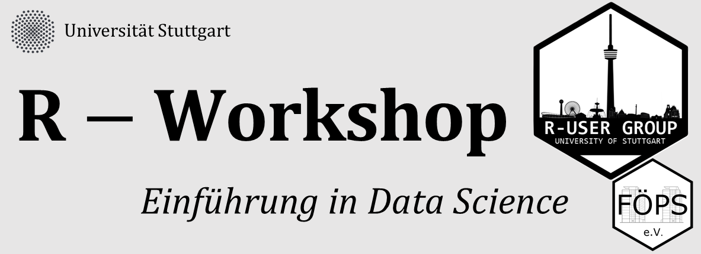

# R - Einführungsworkshop am 10.11.2017

Die R User Group Stuttgart bietet einen kostenlosen Einführungsworkshop für die Statistik-Software R an. Das Thema des Workshops wird die Datenmanipulation und -visualisierung sein.

Alle weiteren Informationen und eine unverbindliche Anmeldung findet ihr unter folgendem Link: https://systats.github.io/flyer/

Wir freuen uns auf euer Erscheinen!

# LearnR Instanzen

* [Instance 1](https://favstats.shinyapps.io/workshop1)
* [Instance 2](https://favstats.shinyapps.io/workshop2)
* [Instance 3](https://favstats.shinyapps.io/workshop3)
* [Instance 4](https://favstats.shinyapps.io/workshop4)
* [Instance 5](https://favstats.shinyapps.io/workshop5)
* [Instance 6](https://favstats.shinyapps.io/workshop6)
* [Instance 7](https://favstats.shinyapps.io/workshop7)
* [Instance 8](https://favstats.shinyapps.io/workshop8)
* [Instance 9](https://favstats.shinyapps.io/workshop9)
* [Instance 10](https://favstats.shinyapps.io/workshop10)
