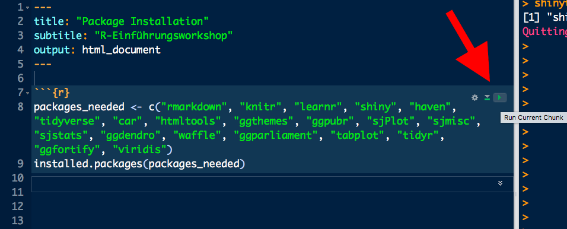

# Hey!

Um am Workshop teilnehemen zu können braucht ihr ein bisschen an Software. **R und Rstudio** sind beide Open Source und damit komplett kostenlos.

# Download

Unter folgendem Link kann R und Rstudio heruntergeladen werden (klicke auf die Logos)

<a href="https://cloud.r-project.org/">
 
<p> 
<a href="https://www.rstudio.com/products/rstudio/download/">
 
</a>

<br>

__Latex zum Erstellen von .pdf Reports__ jeweils für Windows und Mac PCs.

<a href="https://miktex.org/download">
 
</a>

<a href="https://tug.org/mactex/mactex-download.html">
 
</a>


# In Rstudio

1. R installieren
2. Rstudio installieren 
3. Öffne das File workshop_installation**.Rmd** in Rstudio.
4. Drücke den rechten Grünen Pfeil (rechts oberhalb des Codes). Jetzt werden alle diese Packages installiert, was einiges an Zeit braucht. Wenn Probleme auftauchen, werden wir das morgen früh kurz beheben. 



```{r}
needed_packages <- c("rmarkdown", "knitr", "learnr", "shiny", "haven", "tidyverse", "car", "htmltools", "ggthemes", "ggpubr", "sjPlot", "sjmisc", "sjstats", "ggdendro", "waffle", "ggparliament", "tabplot", "tidyr", "ggfortify", "viridis")
install.packages(needed_packages)
```

