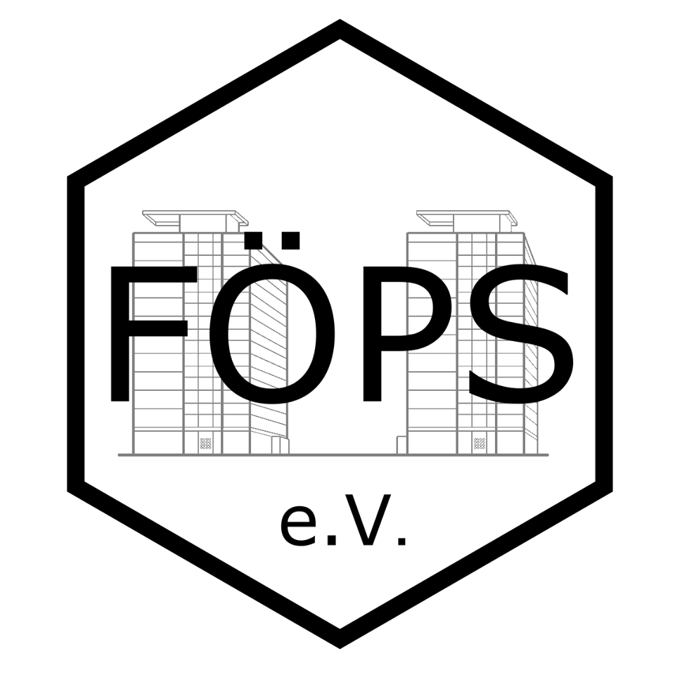
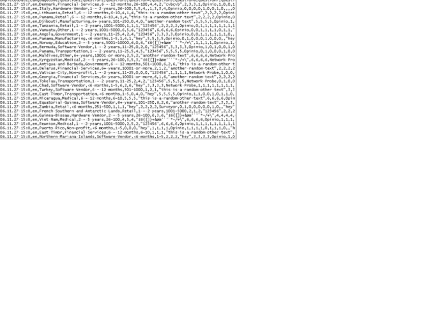
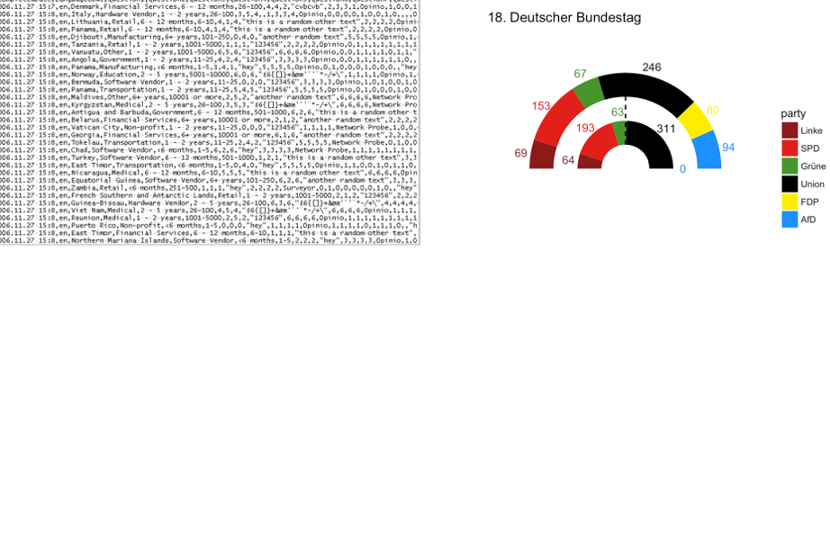
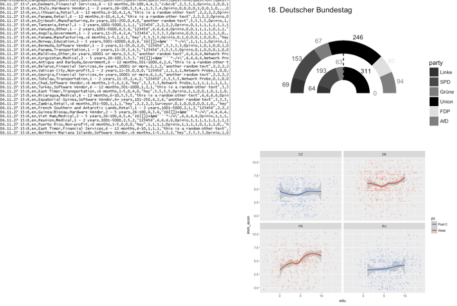
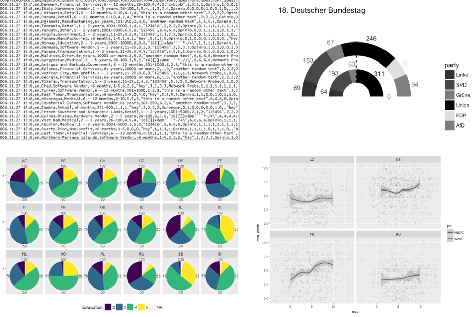
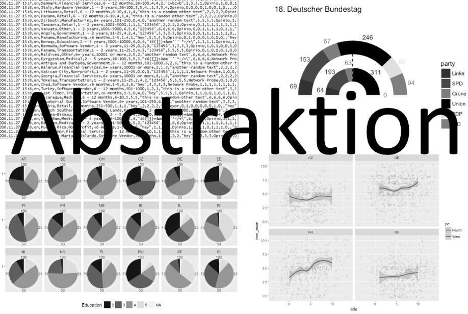
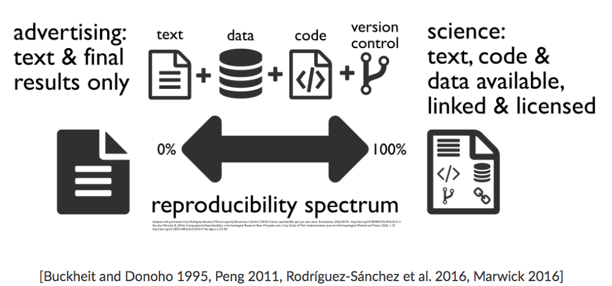
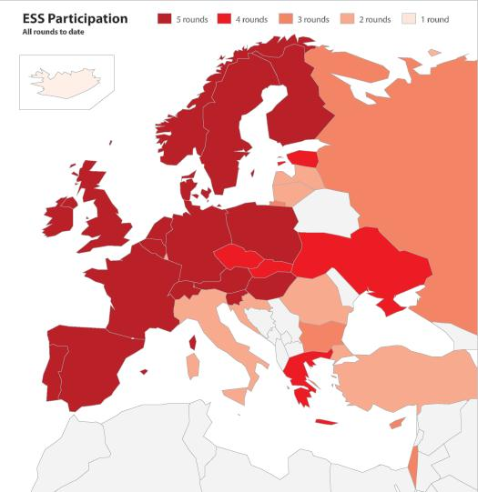
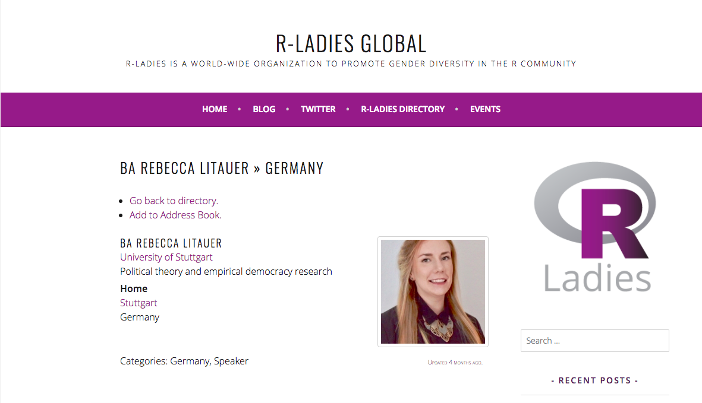

```{r knitr_init, include=F}
knitr::opts_chunk$set(
  echo = F,
  comment = NA, 
  warning = F, 
  error = F,
  message = F,
  warning = F, 
  fig.width = 6, 
  fig.height = 4
)

```

background-image: url(https://r-group-stuttgart.github.io/r_group_logo.jpg)
background-size: contain

---



---

background-image: url(https://www.datenschutzbeauftragter-info.de/wp-content/uploads/2014/04/daten-36.jpg)
background-size: cover
class: inverse, center, middle

# Daten?

---

background-image: url(https://tr3.cbsistatic.com/hub/i/r/2017/04/04/694d6d6e-6602-4aa8-a7af-b5d2f66fff05/resize/770x/d59387bad8400bc8b2b3d51107d2e599/aexcelpowerbi.png)
class: inverse, center, middle

---





---


---

---

---



---


--


--


--


---


# Open Science




---

# Data Science

... und der heutige Fahrplan:

1. Reproducibal Research 
    + Rmarkdown Reports (Code + Text)
2. Exploratory Data Analysis
    + Datenbearbeitung `dplyr`
    + Datenvisualisierung mit `ggplot2`
3. ~~Statistical Modeling~~ wird erst in den kommenden Sitzungen der R-Group besprochen. 
    + Linear Regression
    + Logistic Regression
    + PCA
    + ...

---


# Die Daten 

.pull-left[
* Größtes Europäisches Surveyprojekt (18. Länder) mit über 34.000 Befragten
* Fragen zu sozialen und politischen Themen (seit 2002)
* Finanziell unterstützt durch die EU
* Soz. Daten werden allen interessierten Nutzer transparent, qualitativ hochwertig und kostenlos zur Verfügung gestellt.
* [Homepage](http://www.europeansocialsurvey.org/methodology/)
]

.pull-right[

]


---


# Die Daten 

Der dataframe `ess` beinhaltet folgende Variablen.

* `country`: Land der Befragung
* `gender`: Geschlecht [Weiblich, Männlich]
* `age`: Lebensalter   
* `edu`: Höchster Bildungsabschluss (ISCED) [1-7]
* `income`: Neto Haushaltseinkommen in Dezentilen (1-10 Kategorien zu einkommen in 10% Schritten)
* `pol_inter`: Politisches Interesse [1: überhaupt nicht interessiert; 4: sehr interessiert]
* `left_right`: Selbsteinschätzung Links-Rechtsskala [1: Links, 10: Rechts]
* `gay_tolerance`: Lesben und Schwule können sich frei entfalten [1: lehne ab; 5: stimme zu]
* `religious`: Religiösität [1: gar nicht, 5: sehr]
* `imm_poor`: Armutsmigration von außerhalb Europa's [1: Keine, 4: Viele]
* `imm_econ`: Ist Einwanderung gut oder schlecht für die Wirtschaft? [0: schlecht, 10: gut]
<!-- * `fake_refugee`: Meisten Flüchtlinge sind nicht wirklich verfolgt [1: Stimme nicht zu, 5: Stimme zu] -->
<!-- * `safety`: Fühlst du dich nachts sicher? [1: Sehr unsicher; 4: Sehr sicher] -->
<!-- * `party_right`: Idenifikation mit einer populistischen Partei (europaweit) [...] -->
<!-- * `vote_right`: Indikator - Idenifikation mit einer populistischen Partei (europaweit) [0, 1] -->
<!-- * `party_ger`: Parteiidentifikation (DE) [Linke, Grüne, SPD, Union, AfD] -->


---




---

background-image: url(https://scontent-frt3-2.xx.fbcdn.net/v/t1.0-9/18698439_1518141938238092_7825475589048591284_n.jpg?oh=191197e106b045d4cea5800dad5a5756&oe=5A7210CD)
background-size: contain

---
class: center, middle


# Let's start!
