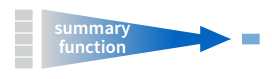

```{r packages, include=FALSE}
#install.packages(c("rmarkdown", "knitr", "learnr", "shiny", "haven", "tidyverse", "car", "htmltools"))
```

```{r presetup, include=FALSE}
knitr::opts_chunk$set(echo = T, warning = F, error = F, message = F)
options(scipen = 999)
```

```{r setup, eval = T, echo = F}
#devtools::install_github("favstats/favstats", dependcies = T, force = T)
library(knitr)
library(learnr)
library(tidyverse)
library(haven)
library(car)
library(htmltools)

normalize <- function(x){round((x - min(x, na.rm = T)) / (max(x, na.rm = T) - min(x, na.rm = T)) * 100, 2)}


vektor <- c(1,2,3,4,5) #definiere Vektor mit den Werten 1,2,3,4 und 5

char <- c("Männlich", "Weiblich")
fac <- factor(c("Männlich", "Weiblich"))
num <- c(1, 2, 3)

#ess <- read_spss("ess_round8.sav")

##var_names(ess, "income")
##sjPlot::view_df(select(ess, freehms), show.frq = F)
##ess$idno
#ess_ger <- ess %>%
#  filter(cntry == "DE") %>%
#  select(idno,
#         gndr,
#         agea,
#         lrscale,
#         prtclede,
#         rfgfrpc) %>%
#  rename(
#    id            = idno,
#    party_ger     = prtclede,
#    left_right    = lrscale,
#    fake_refugee  = rfgfrpc,	
#    gender        = gndr,
#    age           = agea) %>%
##  mutate(fake_refugee2 = 6-fake_refugee) %>%
#  mutate(fake_refugee = to_label(fake_refugee) %>% #as.character) %>%
#  mutate(id = 1:2852) %>%
##  mutate(gay_tolerance = to_label(gay_tolerance) %>% #as.character) %>%
#  mutate_if(.predicate = is.double, .funs = #as.numeric) %>%
#  mutate_if(.predicate = is.character, .funs = #as.character) %>%
#  mutate_if(.predicate = is.factor, .funs = as.factor) #%>%
#  mutate(gender_rec = Recode(gender, 
#                  '1 = "Männlich";
#                   2 = "Weiblich"')) %>%
#  mutate(partei_ident = Recode(party_ger, 
#                  '1 = "CDU/CSU";
#                   2 = "SPD";
#                   3 = "Die Linke";
#                   4 = "Bündnis 90/ Die Grünen";
#                   5 = "FDP";
#                   6 = "AfD";
#                   7:9 = NA'))
#save(ess_ger, file="ess_ger.Rdata")

load("ess_ger.Rdata")

```


## Start

{width="99%"}
<br>

R ist eine Open-Source-Programmiersprache welche speziell für statistische Berechnungen und Visualisierung von Daten und Modellen entwickelt wurde. 

> We believe free and open source data analysis software is a foundation for innovative and important work in science, education, and industry [(RStudio Homepage)](https://www.rstudio.com/).

Für die erleichterte Anwendung von R werden wir das IDE (Integrated Development Environment) namens Rstudio benutzen. Mit Rstudio wird R viel intuitiver durch Syntax Highlighting, Auto-Vervollständigung und einer besseren übersicht über Grafiken, Packages und Datensätze. Die Software ist komplett kostenlos und wird unter einer GPL (GNU General Public License) zugänglich gemacht.


### Installation

Um R benutzen zu können müssen wir erst die nötige Software auf unseren Computer installieren.

Unter folgendem Link kann R heruntergeladen werden

{width=50px}


[**DOWNLOAD R**](https://cloud.r-project.org/)


Unter folgendem Link kann Rstudio heruntergeladen werden

{width=100px}

[**DOWNLOAD RStudio**](https://www.rstudio.com/products/rstudio/download/)

__Latex zum Erstellen von .pdf Reports__

Unter folgenden Links kann die Latex Verteilung MiKTeX (Windows) bzw. MacTeX (Mac) heruntergeladen werden.

{width=100px}

[**DOWNLOAD MiKTeX (Windows)**](https://miktex.org/download)

{width=100px}

[**DOWNLOAD MacTeX (Mac)**](https://tug.org/mactex/mactex-download.html)


## Grundlagen

### R als Taschenrechner

* `+` addieren
* `-` subtrahieren
* `*` multiplizieren
* `/` dividieren
* `^` exponieren

{width=30px}
**Rechenaufgaben:**

1. $34+77$

2. $\frac{500}{125} + 3*6^2$

3. Berechne die Differenz zwischen 2017 und dem Jahr, an dem du begonnen hast zu studieren und dividiere das durch die Differenz zwischen 2017 und dem Jahr, in dem du geboren wurdest. Multipliziere dies mit 100, um den Prozentsatz deines Lebens zu erhalten, den du an die Uni verbracht hast.


```{r zzz, exercise=TRUE, exercise.eval=F}


```

```{r zzz-solution}
34 + 77 
500/125 + 3*6^2
(2017 - study)/(2017 - birth)*100 
#ersetze study durch dein Studienbeginnsjahr und birth durch dein Geburtsjahr
```


### Objekte und Zuweisung


In R kann man je nach Rechenleistung zehntausende Datensätze auf einmal laden und verarbeiten. Das wird möglich da jeder Datensatz seinen eigenen Namen besitzt. Dieser muss mit einem Buchstaben beginnen, kann aber durchaus auch `.` oder `_` oder Zahlen enthalten. Um einem Objekt einen Namen zuzuweisen wird das Zeichen `<-` (Zuweisungspfeil) eingesetzt. Objekte können einzelne Zahlen, Variablen oder auch Datensätze sein. Mit den Objektennamen können Daten jeglicher Art abgespeichert und abgerufen werden. 

```{r obj1, exercise=TRUE, exercise.eval=F}
x <- 1   #definiere x als 1

x

```

{width=30px}
**Aufgabe:** 

Adddiere `x` und `y` und speichere das Ergebnis in z. Gebe z aus!

```{r obj2, exercise=TRUE, exercise.eval=F}
x <- 1   #definiere x als 1
y <- 2   #definiere y als 2


```


```{r obj2-solution}
z <- x + y    #addiere x und y und speicher das Ergebnis in z
z             #geb das Ergebnis aus

```

**Boolean**

- `&` (logisch) und
- `|` (logisch) oder
- `!` (logisch) nicht

{width="80%"}

**Weitere Operatoren**

- `==` (logisch) ist gleich
- `!=` (logisch) ist ungleich
- `%in%` (string) ist gleich
- `>` größer als
- `<` kleiner als
- `>=` größer gleich
- `<=` kleiner gleich
- `is.na()` ist gleich NA (fehlender Wert)
- `!is.na()` ist ungleich NA 


**Beispiele**

```{r com, exercise = T, exercise.eval=F}
3 == 3    #ist 3 gleich 3?
4 > 5     #ist 4 größer als 5?
"albert" == "albert"   #kommt albert in albert vor?


```


R gibt hier entweder `TRUE` oder `FALSE` aus, abhängig davon ob der benutzte logische Operator zutrifft oder nicht.

### Vektoren

Vektoren in R sind einfach mehrere Werte die aneinander gebunden werden. Diese können Zahlen aber auch strings (Buchstabenfolgen) sein. Hiflreich dabei ist die `c()` Funktion (c steht für *concatenate* = verketten auf Deutsch).

**Beispiele:**


```{r vec1, exercise=TRUE, exercise.eval=F}
vektor <- c(1,2,3,4,5) #definiere Vektor mit den Werten 1,2,3,4 und 5
vektor


```

Operatoren können auch ganz einfach mit Vektoren angewandt werden.

```{r vec2, exercise = T, exercise.eval=F}
vektor * vektor     #vektor mit sich selbst mal nehmen
vektor == vektor    #sind alle Werte von vektor gleich alle Werte von vektor?
```

{width=30px}
**Aufgabe**

Bilde einen Vektor mit dem Namen `cm` und den folgenden Größen in Zentimeter: 

- `190` 
- `152` 
- `174` 

Teile dann `cm` durch Hundert um die Größen in Meter zu erhalten!

```{r flu, exercise=TRUE, exercise.eval=F}


```

```{r flu-solution}
cm <- c(190, 152, 174) #Höhen zu cm zuordnen
cm / 100               # cm geteilt durch 100 um m zu erhalten

```


### Funktionen

Das Ziel einer Funktion ist es Daten zu verarbeiten. Dazu gibt es einen *input* und einen *output*. 

Definieren wir doch mal eine Funktion, welche Werte die man als *input* eingibt wieder quadriert als *output* gibt. Dazu benutzen wir `function()` und bestimmen dabei die Argumente welche wir jeweils eintippen wollen. Die Funktion selber wird in geschweiften Klammern `{}` codiert.

**Beispiele:**

```{r function1, eval=T, exercise = T, exercise.eval=F}
quadrieren <- function(input) { 
  output <- input^2        #nehme den input hoch 2 und speichere ihn in output
  output                   #gebe output aus
}

#Funktion ausprobieren!
quadrieren(2)              
```

Wir können auch zwei oder mehrere Argumente zu einer Funktion hinzufügen. Probieren wir das gleiche doch mal mit einer Funktion die jeder aus dem Physik - Unterricht kennen sollte:
$$Distanz \; \; = \; \; \frac{Geschwindigkeit}{Zeit}  \; \; \; \widehat{=} \; \; \; s \;  = \frac{v}{t}$$

```{r function2, exercise = T, exercise.eval=F}
distanz <- function(v, t) {
 s <- v / t       #teile v / t und definiere deren Ergebnis als s
 s                #gebe s aus
}

#Funktion ausprobieren!
distanz(50,6)
```

Nun müssen wir allerdings nicht immer selber Funktionen definieren. Im Gegenteil! `Base R` und die vielen Packages haben unzählige Funktionen, die Datenbearbeitung einfach machen. Beispielsweise gibt `mean()` den Mittelwert eines Vektors aus und `sd()` gibt die Standardabweichung.

```{r func1, exercise = T, exercise.eval=F}
mean(vektor)   #gib den Mittelwert von vektor aus
sd(vektor)     #gib die Standardabweichung von vektor aus
```

### Wie bekommt man Hilfe?

Technische Dokumentation für die meisten Funktionen: `help(name)` oder den Cursor über den Funktionsnamen ausrichten und **F1** drücken.
Nutze ? um Hilfe für Funktionen zu bekommen. 

*Beispiel:* 

```{r func2, exercise = T, exercise.eval=F}
?mean   #gib die Hilfe für mean aus!
```


**Die beste Hilfe**

 


Google weiß einfach alles. 

 


Eine weitere gute Möglichkeit ist [Stackoverflow](https://stackoverflow.com/) für alle Fragen rund ums Programmieren. Dort findet man viele verschiedene Software-Packages und alle Details zu Theorie und Anwendung.


## Dataframes und Base R 

Zunächst einmal eine kleine Übersicht:

**Es gibt drei Variablen-Haupttypen**


- **Character :** aka "String" oder 'String', veränderbarer Text.

- **Factor :** Unveränderliche Ausprägungen (z.B. Gender, Religion).

- **Numeric :** Jeglicher Zahleninput mit dem man rechnen kann.

```{r character, exercise = T, exercise.eval=F}
char <- c("Männlich", "Weiblich")
fac <- factor(c("Männlich", "Weiblich"))
num <- c(1, 2, 3)

class(char)
class(fac)
class(num)


```


**Tranformation zwischen den Datentypen**

- `as.character()`

- `as.factor()`

- `as.numeric()`


```{r ascharacter, exercise = T, exercise.eval=F}
as.character(num)
as.factor(char)
as.numeric(fac)


```


__Lasst uns mal einen Beispieldatensatz einladen.__


 


[**DOWNLOAD European Social Survey Data**](http://www.europeansocialsurvey.org/data/round-index.html)


Der *European Social Survey 8* ist gerade erst erschienen und hat sehr interessante Daten. Dieses transnationale Survey-Projekt enthält über 34.000 Befragte und hunderte von Variablen zu politischen und sozio-ökonomischen Fragestellungen.

Hier ein kleiner Ausschnitt aus dem Datensatz, welches nur das Subset *Deutschland* zeigt:

```{r echo=F}
#ess_ger2 <- ess %>%
#  filter(cntry == "DE") %>%
#  select(idno,
#         gndr,
#         agea,
#         lrscale,
#         prtclede,
#         rfgfrpc) %>%
#  rename(
#    id            = idno,
#    party_ger     = prtclede,
#    left_right    = lrscale,
#    fake_refugee  = rfgfrpc,	
#    gender        = gndr,
#    age           = agea) %>%
##  mutate(fake_refugee2 = 6-fake_refugee) %>%
#  mutate(fake_refugee = to_label(fake_refugee) %>% #as.character) %>%
#  mutate(id = 1:2852) %>%
##  mutate(gay_tolerance = to_label(gay_tolerance) %>% #as.character) %>%
#  mutate_if(.predicate = is.double, .funs = #as.numeric) %>%
#  mutate_if(.predicate = is.character, .funs = #as.character) %>%
#  mutate_if(.predicate = is.factor, .funs = as.factor)
#  
#save(ess_ger2, file="ess_ger2.Rdata")
load("ess_ger2.Rdata")

ess_ger2
```

Möglicherweise habt ihr bemerkt, dass R Buchstabenabkürzungen unter den Spaltennamen des Datensatzes `ess_ger` anzeigt. Diese Abkürzungen beschreiben den Typ der Variablen, die in jeder Spalte gespeichert sind:

* `int` steht für ganze Zahlen (integers).

* `dbl` steht für Doubles oder reelle Zahlen.

* `chr` steht für Zeichenvektoren oder Zeichenfolgen.

* `fctr` steht für Faktoren, die R verwendet, um kategoriale Variablen darzustellen.

**Codebook**

Was bedeuten all diese Werte? Mit der Funktion `view_df` aus dem `sjPlot` package können wir uns ein sehr schönes **Codebook** zeigen lassen! (Funktioniert nur mit SPSS Datensätzen)

<center>
```{r, echo = F}
#ess_ger3 <- ess %>%
#  filter(cntry == "DE") %>%
#  select(idno,
#         gndr,
#         agea,
#         lrscale,
#         prtclede,
#         rfgfrpc) %>%
#  rename(
#    id            = idno,
#    party_ger     = prtclede,
#    left_right    = lrscale,
#    fake_refugee  = rfgfrpc,	
#    gender        = gndr,
#    age           = agea) %>%
#  mutate(id = 1:2852)
#
#sjPlot::view_df(ess_ger3, hide.progress = T, file = #"codebook.html")

includeHTML("images/codebook.html")


```
</center>


<br>
<br>

**Datenzugriff**

Sehr Angenehm kann man auf einzelne Variablen mit Hilfe des Dollarzeichens in der Form `data$variable` zugegriffen werden. Mit der Funktion `table()` können wir uns die Häufigkeiten der Variable ausgeben lassen.

```{r dat, exercise = T, exercise.eval=F}
table(ess_ger$gender)    #zeige Häufigkeiten von Geschlecht
table(ess_ger$party_ger) #zeige Häufigkeiten von Parteiidentifikation
table(ess_ger$fake_refugee) #zeige die Häufigkeiten von fake_refugee

```

Das Ganze macht so natürlich noch nicht so viel Sinn, da die Werte nicht gelabelled sind. Daher müssen wir die Variablen **rekodieren**

### Rekodieren

Eine sehr hilfreiche Funktion für das rekodieren von Variablen ist `Recode()` von dem package `car`. Lasst uns zunächst die Gender Variable rekodieren. Aus dem Codebuch erfahren wir, dass Männer als `1` und Frauen als `2` kodiert sind.

**Hier ein Beispiel:**


```{r reec1, exercise=TRUE, exercise.eval=F}
gender_rec <- Recode(ess_ger$gender, 
                  '1 = "Männlich";
                   2 = "Weiblich"')

table(gender_rec)
```

{width=30px}
**Aufgabe**

Generiere eine neue Variable `partei_ident` mit den folgenden Ausprägungen:

- 1 = "CDU/CSU"
- 2 = "SPD" 
- 3 = "Die Linke"
- 4 = "Bündnis 90/ Die Grünen"
- 5 = "FDP"
- 6 = "AfD"
- 7:9 = NA (kennzeichnet 7 bis 9 als fehlende Werte)

Zeige die Häufigkeiten mit Hilfe der `table()` Funktion.

```{r abc, exercise=TRUE, exercise.eval=F}


```

```{r abc-solution}
partei_ident <- Recode(ess_ger$party_ger, 
                  '1 = "CDU/CSU";
                   2 = "SPD";
                   3 = "Die Linke";
                   4 = "Bündnis 90/ Die Grünen";
                   5 = "FDP";
                   6 = "AfD";
                   7:9 = NA')

table(partei_ident)
```


## Das **`tidyverse`**

```{r, echo=F}
#dat[,c("eink_kat", "eink_num", "spd", "wahl_kat")] <- NULL
```


{width="100%"}


Neben `Base R` gibt es allerdings nonch das `tidyverse`, dass viele mächtige Packages enthält! 

Hier eine kleine übersicht von relevanten Funktionen, die wir brauchen werden:

```{r, echo=FALSE, fig.align='center'}
library(htmltools)
includeHTML("images/marker3.html")
```

### Spalten auswählen mit `select()`

{width=200px}

Mit `select` werden Spalten (=Vektoren/Variablen) mittels dem Variablennamen oder einer Hilfsfunktion ausgewählt. 

Wählen wir wieder nur die zwei folgenden Variables aus: 

- `age`
- `fake_refugee` 

```{r sel, exercise=TRUE, exercise.eval=F}
select(ess_ger , age, fake_refugee)

```

`Select` eignet sich auch dafür Variablen aus einem bestehenden dataframe zu entfernen. Dies ist ganz einfach zu lösen mit einem `-` (Minus).

{width=30px}
**Aufgaben**

1. Wähle die folgende Variablen aus:

- `gender_rec` 
- `left_right`
- `partei_ident`

2. Wähle alle Variablen **außer** `fake_refugee` und `age`.


```{r ddd, exercise=TRUE, exercise.eval=T}


```

```{r ddd-solution}
select(ess_ger, gender_rec, left_right, partei_ident)
select(ess_ger, -fake_refugee, -age)
```


### Zeilen auswählen mit `filter()`

{width=200px}

Mit `filter()` behält man oder selektiert man Zeilen eines Datensatzes, welche bestimmte logische Kriterien oder Konditionen erfüllen. Damit wird ein Subset (Untergruppe) gebildet. Wir wählen jetzt nur die Fälle aus, welche unser Kriterium erfüllen. Jetzt zeigen wir uns Personen an, welchse sich mit der *FDP* identifizieren.

**Beispiel:**

```{r filt, exercise=TRUE, exercise.eval=F}
filter(ess_ger, partei_ident == "FDP")


```

{width=30px}
**Aufgaben**

1. Filtere den Datensatz und zeige nur die Personen, welche sich mit der AfD identifizieren.

2. Filtere den Datensatz und zeige nur die Personen, welche unter 30 Jahre alt sind und sich als eher ganz rechts (größer gleich 8) einstufen.

3. Filtere den Datensatz und zeige nur die Personen, welche sich mit der FDP identifizieren und die Mehrheit der Flüchtlinge als nicht wirklich politisch verfolgt ansehen ("Agree" und "Agree strongly").

```{r bbb, exercise=TRUE, exercise.eval=F}


```

```{r bbb-solution}
filter(ess_ger, partei_ident == "AfD")
filter(ess_ger, age < 30 & left_right >= 8)
filter(ess_ger, partei_ident == "AfD" & (fake_refugee == "Agree" | fake_refugee == "Agree strongly"))
```

*Hier nochmal die Operatoren zum spicken ;)*

- `==` (logisch) ist gleich
- `!=` (logisch) ist ungleich
- `>` größer als
- `<` kleiner als
- `>=` größer gleich
- `<=` kleiner gleich

### Neue Variablen erstellen mit `mutate()`

{width=200px}
{width=200px}

Der `Recode()` Befehl aus dem vorherigen Kapitel lässt sich auch in Kombination mit `mutate()` verwenden. Mit `mutate()` wird/werden eine oder mehrere neue Variable(n) erzeugt und an den Datensatz hinten angefügt.

**Beispiel**

Statt dem Alter wollen wir nun das Geburstjahr haben. Einfacherweise ziehen wir das jetzige Jahr (2017) vom Alter ab um das Geburtsjahr zu erhalten. Die neue Variable nennen wir `birth`.

```{r reec22, exercise=TRUE, exercise.eval=F}
mutate(ess_ger, birth = 2017 - age)


```


{width=30px}
**Aufgabe**

Die Links-Rechts Skala geht von 0 - 10. Teile die Variable durch 10 um einen Range von 0 - 1 zu erhalten. Nenne die Variable `lr01`. Mit `mutate()` wird die Variable hinten angehangen. 


```{r waswas, exercise=TRUE, exercise.eval=F}

```


```{r waswas-solution}
mutate(ess_ger, lr01 = left_right / 10 )
```


Nehmen wir an, dass wir die Altervariable als eine dummy Variable (zwei Ausprägungen) benutzen wollen. Am besten geht das mit `ifelse()`. Kodieren wir doch einmal die 18-40 Jährigen als eine Gruppe und über 40 Jährige als eine andere Gruppe.

Die Funktion `ifelse()` testet eine logische Bedingung in ihrem ersten Argument. Wenn der Test `TRUE` ist, gibt `ifelse()` das zweite Argument zurück. Wenn der Test `FALSE` ist, gibt `ifelse()` das dritte Argument zurück.

Also in folgender Form: `ifelse(logischer Test, was passiert wenn zutrifft, was passiert wenn nicht zutrifft)`

**Beispiel:**

Eine Variable `u40` erstellen welche die 18 bis 40 Jährigen und die über 40 Jährigen in eine Gruppe teilt.

```{r ifelse, exercise = T, exercise.eval=F}
mutate(ess_ger, u40 = ifelse(age <= 40, "18 - 40" ,"< 40"))
#darauf achten, dass bei strings (Wörtern) Anführungsstriche gemacht werden müssen!

```

{width=30px}
**Aufgabe**

Kodiere `partei_ident` AfD (=1) und alle anderen Parteien (=0) und zeige den Datensatz!

```{r mlo, exercise=TRUE, exercise.eval=F}


```

```{r mlo-solution}
mutate(ess_ger, afd = ifelse(partei_ident=="AfD", 1, 0)) # denk an die Charaktere!
```

Die logische Operatoren `&`(und), `|` (oder) können zwei oder mehr Bedingungen miteinander verknüpfen. 

{width=30px}
**Aufgabe**

Kodieren wir eine Variable mit 2 Bedingungen: die Variable **groko**, welche SPD und CDU/CSU (=1) und restliche Parteien (=0) angibt. 

```{r mlp, exercise=TRUE, exercise.eval=F}


```

```{r mlp-solution}
mutate(ess_ger, groko = ifelse(partei_ident == "CDU/CSU" | ess_ger$partei_ident == "SPD" , 1, 0))

```

### Variablen umbennen mit `rename()`

Mit `rename()` lassen sich die Variablen umbennen. Beispielhaft übersetzen wir `age`, `gender` und `links_rechts` Variablennamen ins Deutsche.

**Beispiel:**

```{r ren, exercise=TRUE, exercise.eval=F}
rename(ess_ger,
    alter = age,
    geschl = gender,
    links_rechts = left_right)

```


### Der sexy pipe operator `%>%`

{width=100px}
Mit der Hilfe von `%>%` können alle diese Operationen auf einmal ausgeführt werden!

[Prozent größer Prozent] wird pipe operator genannt. Diese Pipe ermöglicht es Daten einfacher, verständlicher und lesbarer und ohne Verlust von Flexibilität zu transformieren.
Den pipe operator kann man sich als "danach" vorstellen. 

**Hier ein Beispiel:**

```{r piped, exercise=TRUE, exercise.eval=F, exercise.lines = 19}
ess_ger %>%
  select(age, gender, left_right, party_ger) %>%
  mutate(gender_rec = Recode(gender, 
                  '1 = "Männlich";
                   2 = "Weiblich"')) %>%
  mutate(partei_ident = Recode(party_ger, 
                  '1 = "CDU/CSU";
                   2 = "SPD";
                   3 = "Die Linke";
                   4 = "Bündnis 90/ Die Grünen";
                   5 = "FDP";
                   6 = "AfD";
                   7:9 = NA')) %>%
  filter(partei_ident == "AfD") %>%
  rename(alter = age,
    geschl = gender_rec,
    links_rechts = left_right) %>%
  select(geschl, alter, links_rechts, partei_ident)

```

{width=30px}
Jetzt seid ihr dran!

Benutzt die pipe für folgende Aufgaben:

**1. Selektiere die folgenden Variablen**

- `gender_rec`
- `age`
- `left_right`
- `partei_ident`
- `fake_refugee` 

**2. Filtere die Variable und zeige nur Fälle mit der Ausprägung `Männlich`** 

**3. Erstelle eine neue Variable namens `links` mit der Ausprägung `1` für die Werte 0, 1, 2, 3 und `0` für alle anderen. ** 

**4. Benenne die Variable `fake_refugee` in `anti_refugee` um.** 

**5. Selektiere die folgenden Variablen**

- `gender_rec`
- `age`
- `links`
- `anti_refugee`


```{r pop, exercise=TRUE, exercise.eval=F}


```

```{r pop-solution}
ess_ger %>%
  select(gender_rec, age, left_right, partei_ident, fake_refugee) %>%
  filter(gender_rec == "Männlich") %>%
  mutate(links = ifelse(left_right == 0:3, 1, 0)) %>%
  rename(anti_refugee = fake_refugee) %>%
  select(gender_rec, age, links, anti_refugee)

```

### Gruppieren und Summaries

**`group_by` + `summary`**




Mit `group_by()` werden die nachfolgden Operationen gruppenweise ausgeführt. Mit `summarise()` werden die gruppierten Variablen aggregiert

```{r fuu1, exercise=TRUE, exercise.eval=F}
ess_ger %>%
  group_by(partei_ident) %>% # Gruppenvariable
  summarise(mean_age = mean(age, na.rm = T))
```

{width=30px}
**Aufgabe**

Gruppiere `ess_ger` nach `gender_rec` und rechne den Mittelwerte der Links-Rechts Skala (`left_right`) per Geschlecht aus. Vergiss nicht `na.rm = T` zu spezifizieren!

```{r fuu2, exercise=TRUE, exercise.eval=F}

```

```{r fuu2-solution}
ess_ger %>%
  group_by(gender_rec) %>% # Gruppenvariable
  summarise(mean_lr = mean(left_right, na.rm = T))
```


**`group_by` + `tally`**

Um die Fälle innerhalb einer Gruppe zu zählen wird `tally()` eingesetzt.

```{r fuc1, exercise=TRUE, exercise.eval=F}
ess_ger %>%
  group_by(fake_refugee) %>%
  tally
```

## Datenimport und -export

Für den Datenimport muss als erstes der Ordnerpfad für das *working directory* festgelegt werden. Das geht am besten durch einen Rechtsklick auf **Datensatz -> Ordnerpfad**. Bei Windows müssen die Slashes von `\` zu `/` geändert werden.

```{r, eval=F}
#speichere Pfad in path_data
path_data <- "C:/Users/Fabio/Dropbox/9. Semester Master/Tutorium"
#setwd() setzt den working directory zu path_data
setwd(path_data) 
#getwd() zeigt an wo das jetzige working directory sich befindet
getwd()          
```


**Rdata**

Ist das R-native Datenformat.

```{r, eval=F}
#Import
dat <- get(load("file_name.Rdata"))  #lade Datensatz und weise ihn dat zu
#Export
save(dat, file = "file_name.Rdata")  #speichere Datensatz
```


**SPSS**

Das package `haven` erlaubt es Datensätze zwischen den gängigsten Statistik-Programmen zu transportieren.

```{r, eval=F}
# install.packages("haven")        #installiere package "haven"
library(haven)                     #lade package haven

#Import
dat <- read_sav("file_name.sav")   #lade Datensatz und weise ihn dat zu
#Export
write_sav(dat, "file_name.sav")    #speichere Datensatz
```


**CSV**

Wenn ein Excel-Datensatz (.xlsx) vorliegt kann dieser einfach in csv (comma sperated values) abgespeichert werden.

```{r, eval=F}
#Import
dat <- read.csv(file_name = "file.csv",  #lade Datensatz und weise ihn dat zu
               header = T, 
               sep = ",", 
               dec = ".", 
               stringsAsFactors = F)
#Export
write.csv(dat, file = "file_name.csv", row.names = F) #speichere Datensatz
```

**Stata**

```{r, eval=F}
# install.packages("haven")         #installiere package "haven"
library(haven)                      #lade package haven

#Import
dat <- read_dta("file_name.dta")  #lade Datensatz und weise ihn dat zu
#Export
write_dta(dat, "file_name.dta")   #speichere Datensatz
```

**SAS**

```{r, eval = F}
# install.packages("haven")          #installiere package "haven"
library(haven)                       #lade package haven

#Import
dat <- read_sas("file_name.sas7bdat")  #lade Datensatz und weise ihn dat zu
#Export
write_sas(d, "file_name.sas7bdat")     #speichere Datensatz
```


