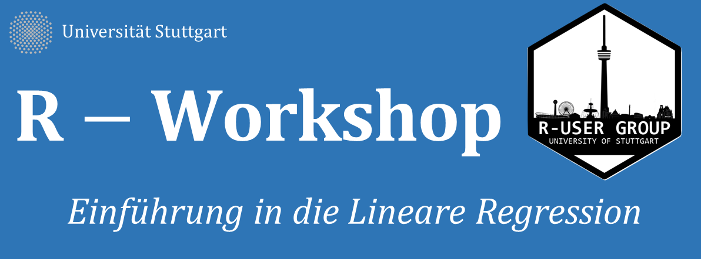

# R User Group Treffen am 16.11.2017

**Thema: Lineare Regression in R**

von *Fabio Votta* und *Simon Roth*

Lineare Regression ist das mit Abstand am häufigsten genutzte statistische Modell der empirischen Sozialforschung. In diesem Workshop lernt ihr die Grundkonzepte der linearen Regression, deren Anwendung sowie Interpretation und Visualisieriung. Alles in R!

Die Materialien zur heutigen Sitzung könnt ihr hier herunterladen. Gehe auf das File [rechtsklick] -> entpacken. Der Order beinhaltet:

1. `learnr` (zum intuitiven Lernen der Konzepte)
2. Online Book zu Statistischer Modellierung (Zusammenfassung)
3. Rmarkdon File zum bearbeiten der Übungsaufgaben

Wie immer stellen wir auch ein Paar `learnr` Server Instanzen zur Verfügung.

* [Instance 1](https://favstats.shinyapps.io/linear_model/)
* [Instance 2](https://favstats.shinyapps.io/linear1/)
