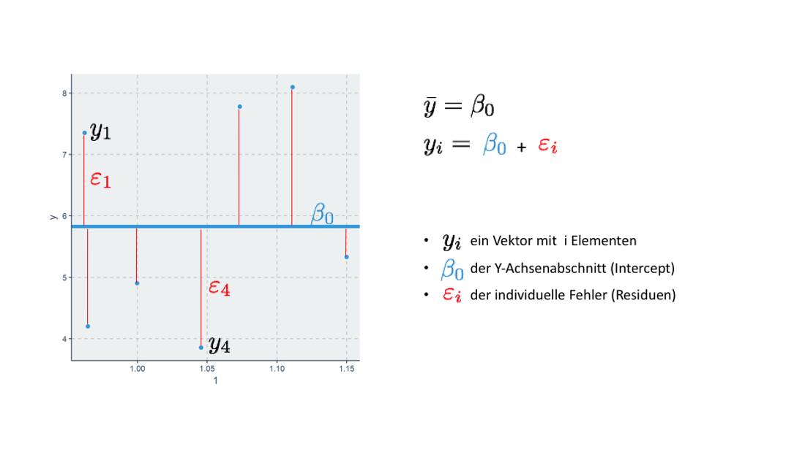
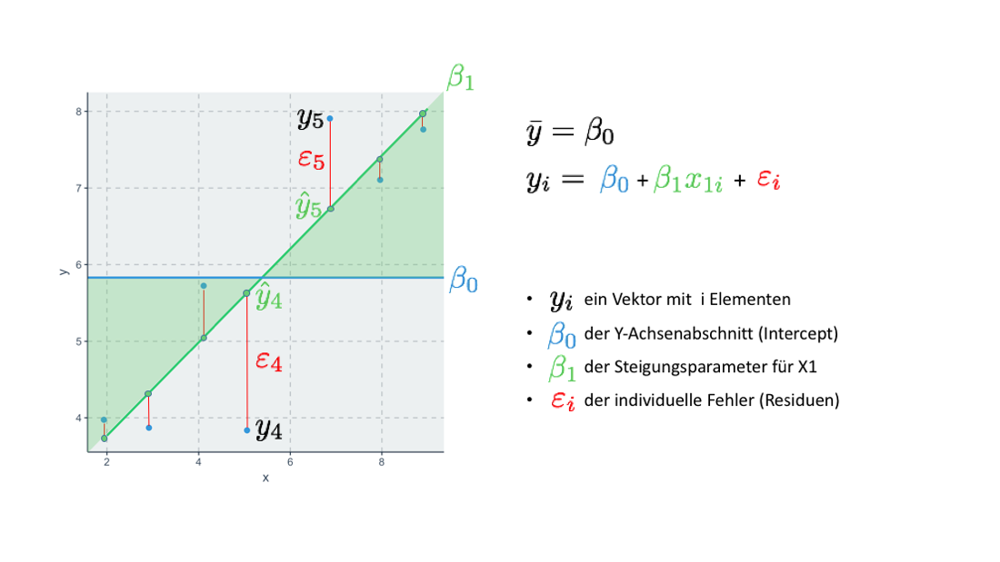
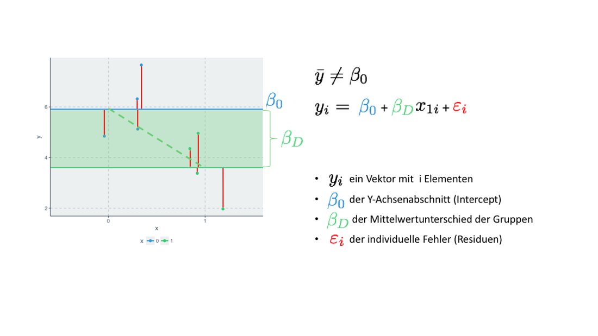

```{r packages, include=FALSE}
#install.packages(c("rmarkdown", "knitr", "learnr", "shiny", "haven", "tidyverse", "car", "htmltools"))
```

```{r opts, include = F}
knitr::opts_chunk$set(
  echo = T, 
  warning = F, 
  error = F, 
  message = F, 
  comment = NA, 
  fig.align = "center")
```

```{r setup, eval = T, echo = F, results = "hide"}
#install.packages("devtools")
#devtools::install_github("Espanta/lubripack")
lubripack::lubripack("knitr", "learnr", "htmltools", "ggplot2", "ggpubr", "shiny", "shinyWidgets", "scatterD3", "flexdashboard", "sjPlot", "texreg", "plotly",  silent = T)

library(knitr)
library(learnr)
library(ggplot2)
library(ggpubr)
library(shiny)
library(shinyWidgets)
library(scatterD3)
library(flexdashboard)
library(sjPlot)
library(texreg)
library(plotly)
#library(ggthemr)
#ggthemr("flat")

# load data
load(url('https://github.com/systats/workshop_data_science/raw/master/Rnotebook/data/ess_workshop.Rdata'))
# filter data

library(dplyr)
ess_ger <- ess %>%
  filter(country == "DE")

fit_null <- ess_ger %>%
  lm(imm_econ ~ 1, data = .)
fit_1 <- ess_ger %>%
  lm(imm_econ ~ edu, data = .)
fit_2 <- ess_ger %>%
  lm(imm_econ ~ vote_right, data = .)
fit_3 <- ess_ger %>%
  lm(imm_econ ~ income + edu, data = .)
```


## Start

{width="99%"}
<br>

> We believe free and open source data analysis software is a foundation for innovative and important work in science, education, and industry [(RStudio Homepage)](https://www.rstudio.com/).


Die verwendeten Daten und Variablen ...

* `country`: Land der Befragung
* `age`: Lebensalter   
* `edu`: Höchster Bildungsabschluss (ISCED) [1-7]
* `income`: Netto Haushaltseinkommen in Dezentile (1-10 Kategorien zu einkommen in 10% Schritten)
* `left_right`: Selbsteinschätzung Links-Rechtsskala [1: Links, 10: Rechts]
* `imm_econ`: Ist Einwanderung gut oder schlecht für die Wirtschaft? [0: schlecht, 10: gut]
* `vote_right`: Indikator - Identifikation mit einer populistischen Partei (europaweit) [0, 1]

Der original ESS-Datensatz der mittlerweile 8 Erhebungswelle kann [Hier](http://www.europeansocialsurvey.org/) herunter geladen werden. 


Eine Übersicht

```{r}
library(dplyr)
glimpse(ess_ger)
```


Schauen wir uns die Variable `imm_econ` an. Also die Frage ob Einwanderung gut oder schlecht für die Wirtschaft ist. 

```{r}
qplot(ess_ger$imm_econ) 
```

Ohne weitere Informationen wie kann diese Verteilung am beschrieben/zusammenfasst werden werden? Welche Schätzung können wir vornehmen?


```{r mean, exercise=TRUE, exercise.eval=F}

```


```{r mean-solution}
mean(ess_ger$imm_econ, na.rm = T)
```


## Null-Modell


Ein Histogramm fasst die Häufigkeiten zu Blöcken zusammen. 

```{r}
qplot(ess_ger$imm_econ) +
  geom_vline(xintercept = 5.83, color = "red", size = 2) 
```


Eine andere Möglichkeit univariate Verteilungen darzustellen ist der Violinplot. Zusätzlich werden auch die einzelnen Datenpunkte aubgebildet. 

```{r univariate, fig.width = 4, fig.height = 6, fig.align="center"}
ess_ger %>%
  ggplot(aes(x = 1, y = imm_econ)) + 
  geom_violin() +
  geom_jitter(alpha = .1, width = .17) +
  geom_abline(slope = 0, intercept = 5.83, size = 2) +
  annotate("text", x = 1, y = 6, 
           label = "Durchschnitt\n Pro-Immigration ", size = 8) +
  scale_y_continuous(breaks = 0:10)
```


$$\bar y = \beta_0$$
$$y_i = \beta_0 + \varepsilon_i$$

Nun schätzen wir diese Formel mit Hilfe von R. Regressionsformeln werden in R durch die sogenannte `formula` definiert. In die Funktion `lm` (*linear model*) wird erst die Y und dann die X Variable(n) geschrieben. Das Symbol `~` (Tilde) wird anstelle des mathematischen ist gleich `=` genutzt. Zuletzt folgt durch ein Komma getrennt der Datensatz. Alle Berechnungen der Regression werden in ein neues Regressionsobjekt `fit_null` (beliebiger Name) gespeichert. So können Unmengen an Modellen geschätzt und später kompakt verglichen werden (dazu später mehr). 

```{r nullmodel, exercise=TRUE, exercise.eval=F, results="markup"}
fit_null <- ess_ger %>%
  lm(imm_econ ~ 1, data = .)

library(texreg)
screenreg(fit_null)
```

```{r, echo = F}
library(texreg)
fit_null <- ess_ger %>%
  lm(imm_econ ~ 1, data = .)
```


```{r, eval = F, echo = F}
set.seed(2017)

data.frame(
  id = 1:7,
  y = c(5, 7, 4, 8, 5, 8,4)
) %>%
  ggplot(aes(x = 1, y = y)) +
  #geom_point() +
  geom_jitter(alpha = 1, width = .17, size = 2) +
  geom_abline(slope = 0, intercept = 5.83, size = 2) 

# ggsave(file = "null_model.png")
```


**Schematische Darstellung eines Nullmodells**

<center>

</center>


## Bivariate Regression

Wenn man die Varianz in `imm_econ` näher untersuchen möchte, kann man eine zweite Dimension aufspannen. In Diesem Fall versuchen wir die abhängige Variab durch Bildung zu erklären. 


```{r edu1}
ess_ger %>%
  ggplot(aes(edu, imm_econ)) +
  #ggscatter(x = "edu", y = "imm_econ", point = F) +
  geom_jitter(alpha = .5) +
  geom_smooth(method = "lm", color = "black", se = F) + 
  ggpubr::stat_cor()
```


```{r, eval = F, echo = F}
data.frame(
  x = c(5, 8, 2, 9, 4,7,3),
  y = c(4, 7, 4, 8, 6, 8,4)
) %>%
  ggplot(aes(x = x, y = y)) +
  #geom_point() +
  geom_jitter(alpha = 1, width = .17, size = 2) +
  geom_smooth(method = "lm", se = F) + 
  geom_abline(slope = 0, intercept = 5.83, size = 1) 

ggsave(file = "bivariate.png")
```

Mathematisch lässt sich die Regressionsgerade so definieren: 

$$y_i = \beta_0 + \beta_1 x_{1i} + \varepsilon_i$$

Anstelle der 1 für den Intercept wird eine Variable eingefügt. Der Intercept wird trotzdem geschätzt. 

```{r firstfit1, exercise=TRUE, exercise.eval=F, results="markup"}
fit_1 <- ess_ger %>%
  lm(imm_econ ~ edu, data = .)

library(texreg)
screenreg(fit_1)
```

```{r firstfit2, echo = F}
library(texreg)
fit_1 <- ess_ger %>%
  lm(imm_econ ~ edu, data = .)
```

**Schematische Darstellung eines bivariaten Modells**


<center>

</center>


**One function to rule them all**

Die Funktion `plot_model` kann unzählige Typen von statistischen Modellen visualisieren. 

type = 

* `est`: Forest plot mit unstandardisierte $\beta$-Koeffizienten (nur multivariat)
* `std`: Forest plot mit standardisierte $\beta^*$-Koeffizienten
* `eff`: Marginale Effects
* `pred`: Predictions
* `slope`: Bivariater Scatterplot
* `diag`: Residuendiagnostik


```{r firstfit4, exercise=TRUE, exercise.eval=F}
library(sjPlot)
library(ggpubr)

plot_model(fit_1) +
  geom_jitter(alpha = .3) +
  stat_cor()

plot_model(fit_1, type = "std")
```


## Shiny App


```{r, echo=FALSE, message=F, warning=F}
library(shiny)
library(shinyWidgets)
library(scatterD3)
library(shiny)
library(flexdashboard)
library(sjPlot)

tagList(
  dropdown(
    tags$h3("Parameter"),
    sliderInput("intercept", label = "Intercept", min = -10, max = 10, value = 0,  step = 1, animate = T),
    sliderInput("slope", label = "Slope", min = -2, max = 2, value = 1, step = .1, animate = T),
    sliderInput("error", label = "RSE", min = 0, max = 10, value = 2, step = .1, animate = T),
    sliderInput("n", label = "N", min = 10, max = 1000, step = 20, value = 100, animate = T),
    
    style = "unite",
    icon = icon("gear"),
    status = "success",
    width = "20%",
    animate = animateOptions(
    enter = animations$fading_entrances$fadeInLeftBig,
    exit = animations$fading_exits$fadeOutRightBig
    )
  ),
  column(8, scatterD3::scatterD3Output("plot", width = "100%")),
  column(4, uiOutput("lm1"),   flexdashboard::gaugeOutput("box")),
  br(),
  fluidRow()
)
```


```{r, context="server"}
# https://cran.r-project.org/web/packages/scatterD3/vignettes/introduction.html
library(sjPlot)
library(flexdashboard)

dat <- reactive({
  set.seed(2017)
  x <- runif(input$n, 1, 7)
  error <- rnorm(input$n, sd = input$error)
  y <- input$intercept + input$slope * x + error
  #y <- 2 + 2 * x + rnorm(100)
  return(data.frame(x, y))
})

#broom::glance(lm(y ~ x, dat()))$r.squared
  output$box <- flexdashboard::renderGauge({
    gauge(round(broom::glance(lm(y ~ x, dat()))$r.squared*100,1), min = 0, max = 100, symbol = '%', label = paste("R squared"))
  })

#output$lm1 <- renderUI(HTML(stargazer::stargazer(lm(y ~ x, dat()), type="html")))
output$lm1 <- renderUI({
  ##nn <- data.frame(x = rnorm(100), y = rnorm(100)) %>%
  nn <- dat() %>%
    lm(y ~ x, .) %>%
    sjt.lm(show.std = T, show.se = F, show.ci = F, use.viewer = F)
  
  nn$knitr %>% 
    HTML()
})
  
output$plot <- scatterD3::renderScatterD3({
  library(scatterD3)
  scatterD3(data = dat(), x = x, y = y, 
          lines = data.frame(
            slope = input$slope, 
            intercept = input$intercept
            ), 
          transitions = T)
  #hchart(dat, "point", hcaes(x, y))  %>%
  #hc_add_series(predictions, type = "line")
})
```

* [Correlation Game](https://gallery.shinyapps.io/correlation_game/)
* [Diagnostics for simple linear regression](https://gallery.shinyapps.io/slr_diag/)


## Dummies


Nominales bzw. qualitatives Messniveaus liegt bei ungeordneten Gruppen oder Klassen von Beobachtungen vor (Beispiele: Geschlecht, Konfessionen, Parteimitgliedschaft, Region, Land etc.). Diese Gruppenvariable wird zur Schätzung in einen s.g. Dummy überführt. Dieser erfordert eine binäre Datenstruktur und wird auch als Indikatorvariable oder als **one-hot encoded** bezeichnet.

$$
D_i = \left\{
\begin{array}{l}
1:\text{ Beobachtungen einer Gruppe}\\
0:\text{ den Rest, nicht Teil der Gruppe}
\end{array}\right.
$$


```{r fitdummy1}
gg1 <- ess_ger %>%
  ggplot(aes(vote_right, imm_econ, fill = vote_right)) +
  geom_boxplot() +
  theme(legend.position = "bottom") +
  stat_compare_means(label = "p.format")

gg2 <- ess_ger %>%
  ggplot(aes(imm_econ, fill = vote_right)) +
  geom_bar(position = position_dodge()) +
  facet_wrap(~vote_right, scales = "free_y", ncol = 1) +
  theme(legend.position = "none")

library(gridExtra)
grid.arrange(gg2, gg1, ncol = 2)
```


```{r fitdummy2, exercise=TRUE, exercise.eval=F, results="markup"}
fit_2 <- ess_ger %>%
  lm(imm_econ ~ vote_right, data = .)

library(texreg)
screenreg(fit_2)
```


Technisch betrachtet können auch Variablen mit Text als Ausprägung geschätzt werden, allerdings werden diese durch das statistische Modell in 0 und 1 transformiert. Der Steigungsparameter $\beta_D$ eines Dummies repräsentiert den Unterschied in der Y-Variable aufgrund der Gruppenzugehörigkeit in $D\{1, 0\}$. Letztere wird Null- oder Referenzkategorie genannt. Wenn eine Variable $k$ Gruppen besitzt, werden diese in $k-1$ Dummyvariablen überführt. Auch ordinale Variablen können so einbezogen werden, allerdings verlieren sie bei der Transformation ihre Ordnungsstruktur und werden als gleiche Klassen behandelt. Beispiel: Geschlecht.

$$
D_i = \left\{
\begin{array}{l}
1:\text{ voted right}\\
0:\text{ not voted right}
\end{array}\right.
$$


```{r, eval = F, echo = F}
ess_ger %>%
  group_by(vote_right) %>%
  summarise(mean_imm = mean(imm_econ, na.rm = T))

ggthemr()

data.frame(
  x = c("0", "0", "0", "0", "1", "1", "1", "1"),
  y = c(5, 6, 8, 5, 3, 5, 4, 2)
) %>%
  ggplot(aes(x = x, y = y, colour = x)) +
  #geom_point() +
  geom_jitter(alpha = 1, width = .5, size = 2) +
  geom_smooth(method = "lm", se = F) + 
  geom_abline(slope = 0, intercept = 5.91, size = 1) + 
  geom_abline(slope = 0, intercept = 3.6, size = 1, color = "#43CD80") + theme(legend.position = "bottom")

#ggsave(file = "dummy.png")
```


**Schematische Darstellung eines Dummy Modells**

<center>

</center>


## Multivariate Regression

Bisher wurde die lineare Regression nur im bivariaten Fall besprochen. Die Forschungspraxis hingegen erfordert multivariate Modelle, um multiple Kausalitäten abbilden zu können. Fügt man eine weitere unabhängige x-Variable hinzu, wird die Regressionsgerade zur Regressionsebene (Fläche). Ab 3D wird es zwar schwer sich vorzustellen, allerdings gelten alle bisherigen Konzepte auch in Vektorräumen n-ter Ordnung.

```{r plane3d, echo = F}
library(plotly)
library(reshape2)

#load data
ess_plane <- ess_ger %>%
  select(edu, imm_econ, income) %>%
  #mutate(imm_econ = scale(imm_econ)) %>%
  na.omit() %>%
  sample_n(size = 100)
  #mutate(pol_inter = ifelse(pol_inter == "Female", 1, 0))

fit_plane <- lm(income ~ 1 + edu + imm_econ, data = ess_plane)

#Graph Resolution (more important for more complex shapes)
graph_reso <- 0.05

#Setup Axis
axis_x <- seq(0, 10, by = graph_reso)
axis_y <- seq(0, 10, by = graph_reso)

#Sample points
fit_plane_surface <- expand.grid(
  edu = axis_x,
  imm_econ = axis_y,
  KEEP.OUT.ATTRS = F
)

fit_plane_surface$income <- predict.lm(fit_plane, newdata = fit_plane_surface)
library(reshape2)
fit_plane_surface <- acast(fit_plane_surface, imm_econ ~ edu, value.var = "income")

#hcolors=c("blue", "red")[dat1$wealth]
library(plotly)

income_plot <- plot_ly(
  ess_plane,
  x = ~ edu,
  y = ~ income,
  z = ~ imm_econ,
  #text = ~ cntry,
  type = "scatter3d",
  mode = "markers", width = 900, height = 700
  #marker = list(color = hcolors)
)

income_plot2 <- add_trace(
  p = income_plot,
  z = fit_plane_surface,
  x = axis_x,
  y = axis_y,
  type = "surface"
)

income_plot2
```

R ermöglicht es viele Modelle gleichzeitig zu schätzen um sie dann zu vergleichen. Im multivariaten Fall wird jede weitere unabhängige x Variable wird durch ein + getrennt ins Model aufgenommen.


```{r fitmulti, exercise=TRUE, exercise.eval=F, results="markup"}
fit_3 <- ess_ger %>%
  lm(imm_econ ~ income + edu, data = .)

library(texreg)
screenreg(fit_3)
```


```{r fitmulti2, exercise=TRUE, exercise.eval=F}
library(sjPlot)
library(ggpubr)

plot_model(fit_3)

sjp.lm(fit_3, type = "eff")
```


## Aufgaben

Wechsele zu RStudio und öffne das File `xxx`. Löse darin folgende Aufgaben:


1. Erstelle ein bivariates Modell für `imm_econ` als abhängige und `left_right` als unabhängige Variable. 

    - 1a. Interpretiere den $\beta$ Koeffizienten und das $R^2$.
    - 1b. Dann visualisiere das Modell.

2. Kopiere das letzte Modell und ergänze es um `gender`.

    - 2a. Interpretiere die $\beta$ Koeffizienten und das $R^2$.
    - 2b. Dann visualisiere das Modell.

3. Vergleiche das Modell aus 1 und 2. Was fällt auf?


```{r, echo=FALSE, message=F, warning=F, eval = F, echo = F}
library(shiny)
load(url('https://github.com/systats/macro_project/raw/master/project_macro.Rdata'))
div(style="display: inline-block;vertical-align:top; width: 45%;", sliderInput("year", label = "Year", min = 1960, max = 2010, value = 2000,  step = 1, animate = T))
div(style="display: inline-block;vertical-align:top; width: 25%;", selectInput("x", label = "x", choices = colnames(project_macro), selected = "exports"))
div(style="display: inline-block;vertical-align:top; width: 25%;", selectInput("y", label = "y", choices = colnames(project_macro), selected = "free_polity"))
library(scatterD3)
scatterD3::scatterD3Output("plot1")
```

```{r, context="server", eval = F, echo = F}
# https://cran.r-project.org/web/packages/scatterD3/vignettes/introduction.html
load(url('https://github.com/systats/macro_project/raw/master/project_macro.Rdata'))
# filter data

output$plot1 <- scatterD3::renderScatterD3({

  library(dplyr)
  dat <- project_macro %>% 
  filter(year == input$year) 
  
  library(scatterD3)
  scatterD3(x = dat[[input$x]], y = dat[[input$y]], 
            col_var = dat$region, size_var = dat$pop_total, 
            transitions = T, lab = dat$country)
})
```


<!-- ```{r filt, exercise=TRUE, exercise.eval=F} -->
<!-- filter(ess_ger, partei_ident == "FDP") -->


<!-- ``` -->

<!-- {width=30px} -->

<!-- ```{r bbb, exercise=TRUE, exercise.eval=F} -->


<!-- ``` -->

<!-- ```{r bbb-solution} -->
<!-- filter(ess_ger, partei_ident == "AfD") -->
<!-- filter(ess_ger, age < 30 & left_right >= 8) -->
<!-- filter(ess_ger, partei_ident == "AfD" & (fake_refugee == "Agree" | fake_refugee == "Agree strongly")) -->
<!-- ``` -->

<!-- ```{r reec22, exercise=TRUE, exercise.eval=F} -->
<!-- mutate(ess_ger, birth = 2017 - age) -->


<!-- ``` -->

<!-- ```{r waswas, exercise=TRUE, exercise.eval=F} -->

<!-- ``` -->


<!-- ```{r waswas-solution} -->
<!-- mutate(ess_ger, lr01 = left_right / 10 ) -->
<!-- ``` -->


<!-- ```{r ifelse, exercise = T, exercise.eval=F} -->
<!-- mutate(ess_ger, u40 = ifelse(age <= 40, "18 - 40" ,"< 40")) -->
<!-- #darauf achten, dass bei strings (Wörtern) Anführungsstriche gemacht werden müssen! -->

<!-- ``` -->

<!-- {width=30px} -->


<!-- ```{r mlo, exercise=TRUE, exercise.eval=F} -->


<!-- ``` -->

<!-- ```{r mlo-solution} -->
<!-- mutate(ess_ger, afd = ifelse(partei_ident=="AfD", 1, 0)) # denk an die Charaktere! -->
<!-- ``` -->


<!-- {width=30px} -->

<!-- ```{r mlp, exercise=TRUE, exercise.eval=F} -->


<!-- ``` -->

<!-- ```{r mlp-solution} -->
<!-- mutate(ess_ger, groko = ifelse(partei_ident == "CDU/CSU" | ess_ger$partei_ident == "SPD" , 1, 0)) -->

<!-- ``` -->

