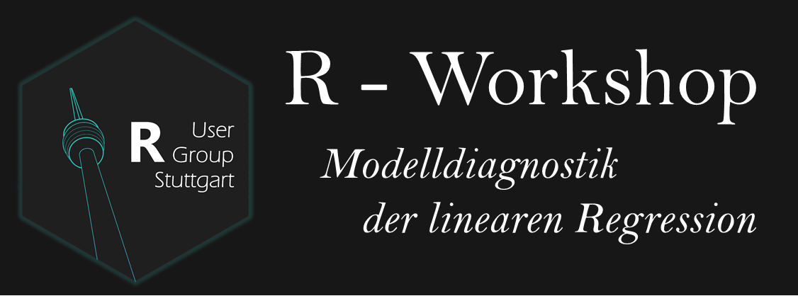

# R User Group Treffen am 30.11.2017

**Thema: Modelldiagnostik**

Die R User Group Stuttgart trifft sich für einen kleinen Einführungsworkshop zum Thema „Modelldiagnostik der linearen Regression in R“. Dieser findet am Donnerstag , den 30.11.2017 von 17:30 bis 19:00 im CIP Pool der Breitscheidstraße 2 (M2.5.005) statt.  

*Modelldiagnostik.*
Die Modelldiagnostik dient dazu die Validität und Reliabilität der Ergebnisse einer linearen Regression sicherzustellen. Wenn alle Annahmen erfüllt sind, kann man von einer bestmöglichsten Parameterschätzung sprechen, was auch Best Linear Unbiased Estimator genannt wird (BLUE, siehe Gauß-Markov-Theorem). In diesem Workshop lernt ihr die Grundkonzepte der Modelldiagnostik für lineare Modelle, deren Anwendung sowie Interpretation und Visualisierung. Alles in R!

Wir freuen uns auf euer Erscheinen, 

die R-Group Stuttgart"

