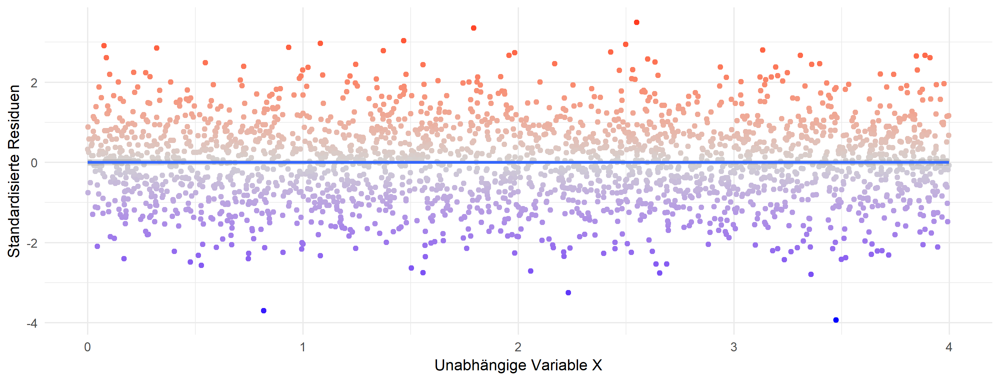
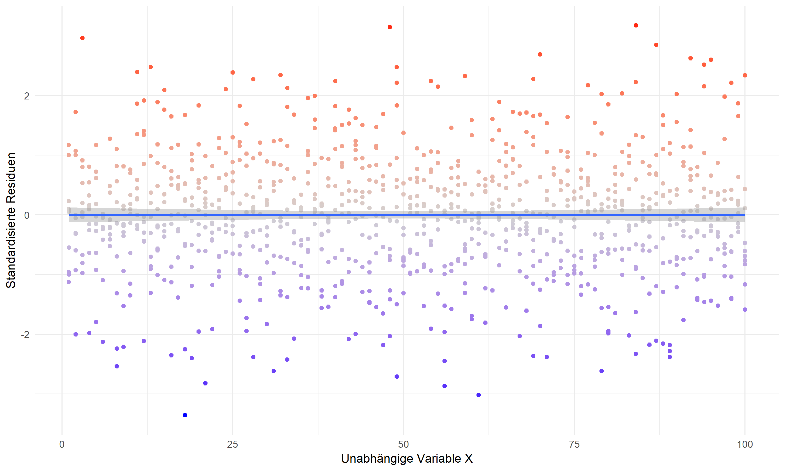
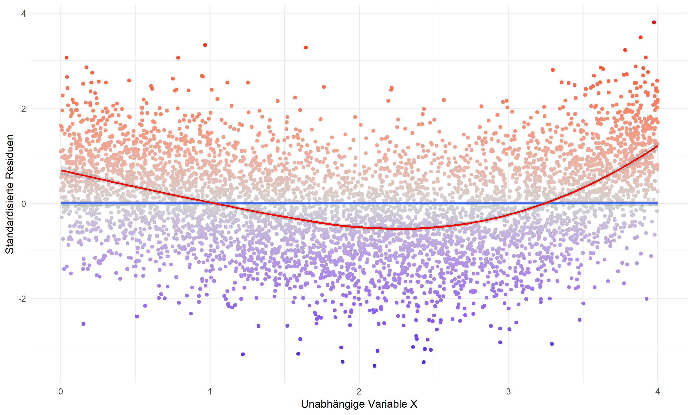
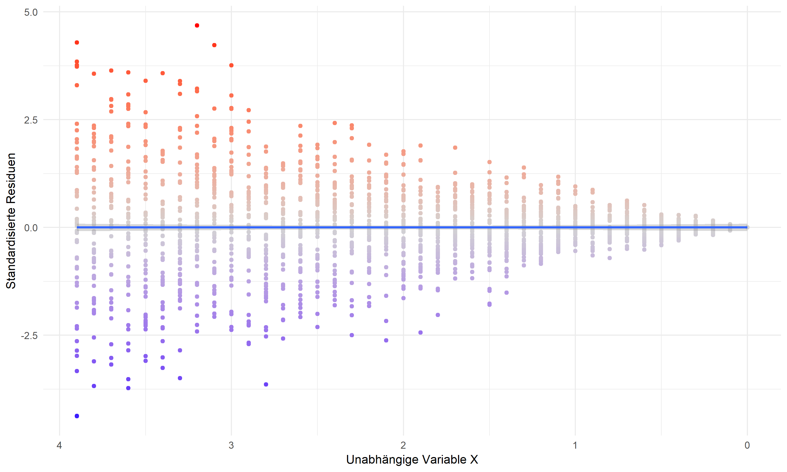
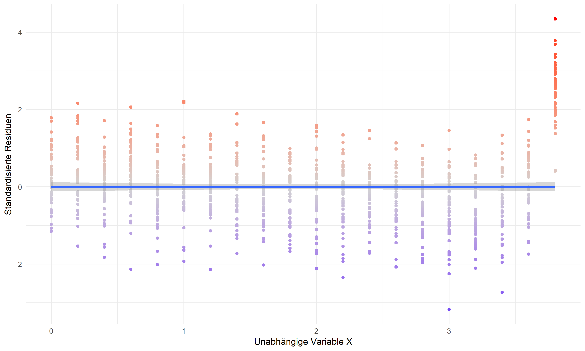
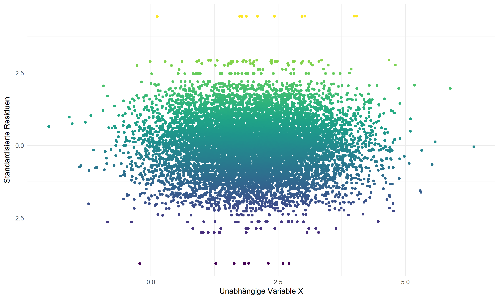
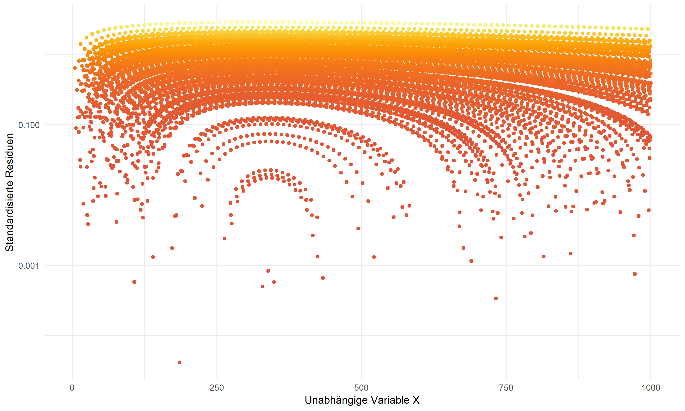
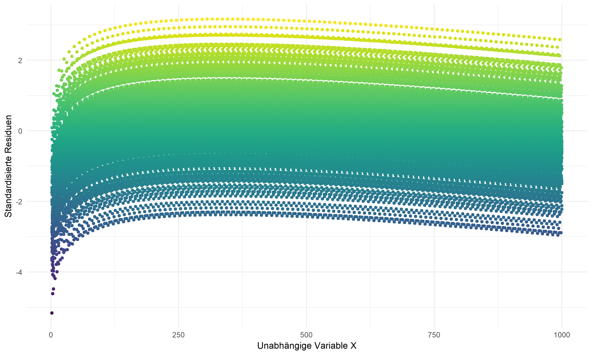

<!-- To DOs -->

<!-- - Fehlerkorrelation mit X -->
<!-- Startseite anpassen (github repository) -->
<!-- Aufschreiben was wir sagen -->
<!-- Banner -->

```{r packages, include=FALSE}
#install.packages(c("rmarkdown", "knitr", "learnr", "shiny", "haven", "tidyverse", "car", "htmltools"))
```

```{r opts, include = F}
knitr::opts_chunk$set(
  echo = T, 
  warning = F, 
  error = F, 
  message = F, 
  comment = NA, 
  fig.align = "center")
```

```{r setup, eval = T, echo = F, results = "hide"}
#install.packages("devtools")
#devtools::install_github("Espanta/lubripack")
#lubripack::lubripack("knitr", "learnr", "htmltools", "ggplot2", "ggpubr", "shiny", #"shinyWidgets", "scatterD3", "flexdashboard", "sjPlot", "broom", "texreg", "plotly",  silent #= T)

library(knitr)
library(learnr)
library(tidyverse)
library(shiny)
library(shinyWidgets)
library(tidyr)
library(texreg)
library(broom)
#library(ggthemr)
#ggthemr("flat")

# load data
#load(url('https://github.com/systats/workshop_data_science/raw/master/Rnotebook/data/ess_workshop.Rdata'))
# filter data


```


## Start

{width="99%"}
<br>

> We believe free and open source data analysis software is a foundation for innovative and important work in science, education, and industry [(RStudio Homepage)](https://www.rstudio.com/).

**Das wichtigste zuerst:**


Die Materialien zur Sitzung findet ihr im folgenden [GitHub Repository](https://github.com/favstats/rgroup_diagnostik):

<br>
<br>

**Kontakt:**


Wir haben jetzt auch eine [XING-Gruppe](https://www.xing.com/communities/groups/r-user-group-stuttgart-c0de-1101184):

<br>
<br>
<br>
<br>


Oder tretet unserer Gruppe auf [Facebook](https://www.facebook.com/groups/rstuttgart/) bei:

<br>
<br>


```{r, include=F}
generate_multi <- function(n, corseq){
  set.seed(2017)
  x <- runif(n, 1, 10)
#  corseq <- seq(0,.99,0.01)
  models <- list()
  for (jj in seq_along(corseq)) {
    dat <- data.frame(corgen(x = x, r = corseq[jj],  epsilon = 0))
    colnames(dat) <- c("x1", "x2")
    dat$y <- 0.5 * dat$x1 + 0.5 * dat$x2 + rnorm(n, sd = 10)
    models[[jj]] <- tidy(lm(y ~ x1 + x2, data = dat))
    models[[jj]]$cors <- corseq[jj]
#    cat(jj, "\n")
  }
  sim_dat <- bind_rows(models)
  sim_dat$col <- n
  return(sim_dat)
}

draw.data <- function(type, slope = 2, error = 8, n = 100){
  if(type=="linear.up"){
    x <- c(runif(n-2, 0, 4), 2, 2.1)
    y <- slope * x + rnorm(n, sd=error)
  }
  if(type=="linear.down"){
    x <- c(runif(n-2, 0, 4), 2, 2.1)
    y <- -slope * x + rnorm(n, sd=error)
  }
  if(type=="curved.up"){
    x <- c(runif(n-2, 0, 4), 2, 2.1)
    y <- slope * x^4 + rnorm(n, sd=error)
  }
  if(type=="curved.down"){
    x <- c(runif(n-2, 0, 4), 2, 2.1)
    y <- -slope * x^4 + rnorm(n, sd=error)
  }
  if(type=="curved.lowhigh"){
    x <- rep(1:100,1)
    y  <- slope * x + rnorm(x, sd = c(50:1, 1:50)) 
  }
  if(type=="fan.shaped"){
    x = seq(0,3.99,4/n)
    y = slope * x + rnorm(n, sd = sqrt(x^1.3))
  }
  if(type=="auto.corr"){
    x <- rep(1:100,1)
    intercept <- c(rep(c(1,3,6,9,12), each = 20))
    y  <- intercept + slope * x + rnorm(100, sd = 5) 
    return(data.frame(x=x,y=y,col=as.factor(intercept)))
  }
  if(type=="multicol"){
    corseq <- seq(0,.99,0.01)
    n <- seq(50, 3000, by = 200)
    sim.list <- list()
    for(jj in seq_along(n)) {
      sim.list[[jj]] <- generate_multi(n = n[jj], corseq)
    } 
    sim_data <- bind_rows(sim.list)
    return(sim_data)
}
  data.frame(x=x,y=y)
}


```


## Modelldiagnostik


```{r, echo=FALSE, message=F, warning=F}
library(shiny)

tagList(
  withMathJax(),
  navbarPage("",
    navbarMenu("Ideal",
      tabPanel("Linear positiv",
               img(src = "images/linearup.png", 
                   width = "80%", align = "left"),"Die wichtigste Annahme der lineare Regression besagt, dass f(x) also y als eine lineare Funktion von x approximiert wird (true data generating process is linear).", " Die Werte können durchaus weiter Streuen, die Richtung des Zusammenhangs sollte jedoch linear sein."),
      tabPanel("Linear negativ",
               img(src = "images/lineardown.png", 
                   width = "80%", align = "left"),"Die wichtigste Annahme der lineare Regression besagt, dass f(x) also y als eine lineare Funktion von x approximiert wird (true data generating process is linear).", " Die Werte können durchaus weiter Streuen, die Richtung des Zusammenhangs sollte jedoch linear sein.")
    ),
    navbarMenu("Non-Linearität",
      tabPanel("Quadratisch - Konvex",
               img(src = "images/quadraticup.png", 
                   width = "80%", align = "left"), "Wenn der wahre Daten-Generierungs-Prozess quadratisch ist und nicht definiert wird, dann liegt eine schwerwiegende Verletzung der Linearitätannahme vor. Solch eine Fehlspezifikation kann dazu führen, dass die Parameter die Realität in den Daten verzerrt darstellen."),
      tabPanel("Quadratisch - Konkav",
               img(src = "images/quadraticdown.png", 
                   width = "80%", align = "left"), "Wenn der wahre Daten-Generierungs-Prozess quadratisch ist und nicht definiert wird, dann liegt eine schwerwiegende Verletzung der Linearitätannahme vor. Solch eine Fehlspezifikation kann dazu führen, dass die Parameter die Realität in den Daten verzerrt darstellen.")
    ),    
    navbarMenu("Heteroskedastizität",
      tabPanel("Zufällige Muster",
               img(src = "images/curvedlowhigh.png", 
                   width = "80%", align = "left"), "Eine zentrale Annahme der linearen Regression ist Homoskedatsizität. Homoskedastie beschreibt die konstante oder gleichverteilte Streuung um die Regressionsgerade.",
br(),
               "$$var(\\varepsilon_i) = \\frac{1}{n}\\sum^N_{i=1} \\varepsilon_i = \\sigma^2_{\\varepsilon}n$$", "Diese Bedingung bezieht sich auf die Verallgemeinerbarkeit des Standardfehlers SE auf die gesamte Schätzung. Wenn ungleiche Fehlervarianzen vorliegen spricht man von ", strong("Heteroskedastizität"), " wodurch die Signifikanztest nicht mehr interpretiert werden dürfen."),
      tabPanel("Fehlerkorrelation",
               img(src = "images/fanshaped.png", 
                   width = "80%", align = "left"), "Die wohl wichtigste Annahme ist die Unkorreliertheit der Fehler mit dem Model oder x Variablen.", "$$cov(x_i, \\varepsilon_i) = 0$$", "Die lineare Projektion ist durch den Schätzer determiniert orthonormal. Wenn diese Annahme verletzt ist", "$$cov(x_i, \\varepsilon_i) \\neq 0$$", "liegt eine schwerwiegende Fehlspezifikation vor. In der Regel handelt es sich um einen Omitted Variable Bias (OVB).")
    ),
    navbarMenu("Abhängigkeit der Fehler",
      tabPanel("Clusterkorrelation",
               img(src = "images/cluster.png", 
                    width = "70%", align = "left"), "Der Begriff ", strong("Clusterkorrelation"), " beschreibt den Umstand, dass sich bestimmte Beobachtungen nähher sind als andere.", "Beipiele sind Schüler in Schulklassen oder Befragte aus verschiedenen Ländern",
               #"Meistens werden Niveauunterschiede und Effektheterogenitäten modelliert.", 
               "Idealerweise werden Multilevel Regressionen eingesetzt:", "$$y_i = \\beta_{0j} + \\beta_{1} x_{ij} + \\varepsilon_ij$$", "Wird eine bekannte Ordnungsstruktur, Hierarchie oder räumliche Gruppenzugehörigkeit in den Daten ignoriert, werden die Standardfehler unterschätzt, da sie von N abhängen und nicht gruppenweise geschätzt werden. ", "$$SE_j(\\beta_j) = \\frac{\\sigma_j}{s_{xj}\\sqrt{n_j}} > SE(\\beta) = \\frac{\\sigma}{s_{x}\\sqrt{n}}$$"),
      tabPanel("Autokorrelation",
               img(src = "images/auto.png", 
                    width = "70%", align = "left"), "Autokorrelation unterscheidet sich zu Clusterkorrelation durch eine Zeitdimension. In der Regel handelt es sich um wiederholte Messzeitpunkte oder Befragungen (repeated measurement). Diese sogenannten Panel-Daten haben ihre eigen Panel Modelle hervorgebracht.", "$$y_{it} =  \\beta x_{it} + \\delta z_{i} + \\alpha_i + \\varepsilon_{it}$$", "Nach einer Within-Transformation (Demeaning) bleiben nur noch die zeitvariablen Differenzen übrig.", "$$y_{it}-\\bar y_{i} = (x_{it}-\\bar x_{i}) \\beta + (\\varepsilon_{it}-\\bar \\varepsilon_i)$$", "Wenn mit Panel-Daten eine lineare Regression (OLS) geschätzt wird, werden die ")
    ),
    navbarMenu("(Multi-)Kolinearität",
      tabPanel("Verzerrung: Standardfehler und t-Statistik",
               img(src = "images/multicol1.png", 
                   width = "100%")),
      tabPanel("Verzerrung: b-Koeffizienten",
               img(src = "images/multicol2.png", 
                   width = "100%"))
    ),
    navbarMenu("Ausreißer",
      tabPanel("Verzerrung",
               img(src = "images/outlier.png", 
                   width = "100%")),
      tabPanel("Cook's Distance",
               img(src = "images/cooksd.png", 
                   width = "100%")) 
    )
  )
)


```

## Übungsaufgaben

#### **Aufgabe 1:**

<center>
{width="80%"}
</center>

```{r letter-a, echo=FALSE}
question("**Aufgabe 1:** Welche Probleme könnten hier vorliegen?",
  answer("Non-Linearität"),
  answer("Heteroskedastizität"),
  answer("Fehlerkorrelation"),
  answer("Autokorrelation"),
  answer("Multikolinearität"),
  answer("Ausreißer"),
  answer("Es liegen keine Probleme vor",  message = "Richtige Antwort!", correct = TRUE),
  allow_retry = TRUE,
  random_answer_order = TRUE,
  incorrect = "Falsche Antwort oder es fehlen noch mehr Antworten."
)
```


#### **Aufgabe 2:**

<center>
{width="80%"}
</center>

```{r letter-d, echo=FALSE}
question("**Aufgabe 2:** Welche Probleme könnten hier vorliegen?",
  answer("Non-Linearität"),
  answer("Heteroskedastizität", correct = TRUE),
  answer("Fehlerkorrelation", message = "Richtige Antwort!", correct = TRUE),
  answer("Autokorrelation"),
  answer("Multikolinearität"),
  answer("Ausreißer"),
  answer("Es liegen keine Probleme vor"),
  allow_retry = TRUE,
  random_answer_order = TRUE,
  incorrect = "Falsche Antwort oder es fehlen noch mehr Antworten."
)
```

#### **Aufgabe 3:**

<center>
{width="80%"}
</center>

```{r letter-e, echo=FALSE}
question("**Aufgabe 3:** Welche Probleme könnten hier vorliegen?",
  answer("Non-Linearität"),
  answer("Heteroskedastizität"),
  answer("Fehlerkorrelation"),
  answer("Autokorrelation"),
  answer("Multikolinearität"),
  answer("Ausreißer"),
  answer("Es liegen keine Probleme vor", message = "Richtige Antwort!", correct = TRUE),
  allow_retry = TRUE,
  random_answer_order = TRUE,
  incorrect = "Falsche Antwort oder es fehlen noch mehr Antworten."
)
```

#### **Aufgabe 4:**

<center>
{width="80%"}
</center>


```{r letter-b, echo=FALSE}
question("**Aufgabe 4:** Welche Probleme könnten hier vorliegen?",
  answer("Non-Linearität", correct = TRUE),
  answer("Heteroskedastizität", correct = TRUE),
  answer("Fehlerkorrelation", message = "Richtige Antwort!", correct = TRUE),
  answer("Autokorrelation"),
  answer("Multikolinearität"),
  answer("Ausreißer"),
  answer("Es liegen keine Probleme vor"),
  allow_retry = TRUE,
  random_answer_order = TRUE,
  incorrect = "Falsche Antwort oder es fehlen noch mehr Antworten."
)
```

#### **Aufgabe 5:**

<center>
{width="80%"}
</center>

```{r letter-f, echo=FALSE}
question("**Aufgabe 5:** Welche Probleme könnten hier vorliegen?",
  answer("Non-Linearität"),
  answer("Heteroskedastizität", correct = TRUE),
  answer("Fehlerkorrelation", message = "Richtige Antwort!", correct = TRUE),
  answer("Autokorrelation"),
  answer("Multikolinearität"),
  answer("Ausreißer"),
  answer("Es liegen keine Probleme vor"),
  allow_retry = TRUE,
  random_answer_order = TRUE,
  incorrect = "Falsche Antwort oder es fehlen noch mehr Antworten."
)
```

#### **Aufgabe 6:**

<center>
{width="80%"}
</center>

```{r letter-g, echo=FALSE}
question("**Aufgabe 6:** Welche Probleme könnten hier vorliegen?",
  answer("Non-Linearität"),
  answer("Heteroskedastizität", message = "Richtige Antwort!", correct = TRUE),
  answer("Fehlerkorrelation"),
  answer("Autokorrelation"),
  answer("Multikolinearität"),
  answer("Ausreißer"),
  answer("Es liegen keine Probleme vor"),
  allow_retry = TRUE,
  random_answer_order = TRUE,
  incorrect = "Falsche Antwort oder es fehlen noch mehr Antworten."
)
```

#### **Aufgabe 7:**

<center>
{width="80%"}
</center>

```{r letter-h, echo=FALSE}
question("**Aufgabe 7:** Welche Probleme könnten hier vorliegen?",
  answer("Non-Linearität"),
  answer("Heteroskedastizität", message = "Richtige Antwort!", correct = TRUE),
  answer("Fehlerkorrelation"),
  answer("Autokorrelation"),
  answer("Multikolinearität"),
  answer("Ausreißer"),
  answer("Es liegen keine Probleme vor"),
  allow_retry = TRUE,
  random_answer_order = TRUE,
  incorrect = "Falsche Antwort oder es fehlen noch mehr Antworten."
)
```

#### **Aufgabe 8:**

<center>
{width="80%"}
</center>

```{r letter-i, echo=FALSE}
question("**Aufgabe 8:** Welche Probleme könnten hier vorliegen?",
  answer("Non-Linearität", correct = TRUE),
  answer("Heteroskedastizität", correct = TRUE),
  answer("Fehlerkorrelation", message = "Richtige Antwort!", correct = TRUE),
  answer("Autokorrelation"),
  answer("Multikolinearität"),
  answer("Ausreißer"),
  answer("Es liegen keine Probleme vor"),
  allow_retry = TRUE,
  random_answer_order = TRUE,
  incorrect = "Falsche Antwort oder es fehlen noch mehr Antworten."
)
```

#### **Aufgabe 9:**

<center>
{width="80%"}
</center>

```{r letter-j, echo=FALSE}
question("**Aufgabe 9:** Welche Probleme könnten hier vorliegen?",
  answer("Non-Linearität", correct = TRUE),
  answer("Heteroskedastizität", correct = TRUE),
  answer("Fehlerkorrelation", message = "Richtige Antwort!", correct = TRUE),
  answer("Autokorrelation"),
  answer("Multikolinearität"),
  answer("Ausreißer"),
  answer("Es liegen keine Probleme vor"),
  allow_retry = TRUE,
  random_answer_order = TRUE,
  incorrect = "Falsche Antwort oder es fehlen noch mehr Antworten."
)
```

## Anwendung

```{r, echo = F, eval = T}
#options(scipen = 999)
#devtools::install_github('cttobin/ggthemr')

lubripack::lubripack("dplyr", "broom", "ggplot2", "ggthemes", "gridExtra", "car", "sjPlot", "broom", silent = T)

library(ggthemr)
ggthemr("flat")
```


Im Folgenden soll nun gezeigt werden, wie die bisher gezeigten Untersuchungen ganz einfach in `R` umzusetzen sind.

Zunächst müssen wir einen Datensatz einladen und ein Modell fitten. Wählen wir die folgenden Variablen dazu aus:

```{r, echo = T, comment=""}
# load data
load(url('https://github.com/systats/workshop_data_science/raw/master/Rnotebook/data/ess_workshop.Rdata'))
# filter data

library(dplyr)
library(sjPlot)
ess_ger <- ess %>%
  dplyr::filter(country == "DE") %>%
  mutate(age2 = age*age)

fit <- lm(imm_econ ~ left_right + edu + income + age + gender, data = ess_ger)
```

```{r include=FALSE}
fit_ma <- sjp.lm(fit, type = "ma")
```


__Die verwendeten unabhängigen Variablen ...__

* `age`: Lebensalter   
* `edu`: Höchster Bildungsabschluss (ISCED) [1-7]
* `income`: Netto Haushaltseinkommen in Dezentile (1-10 Kategorien zu einkommen in 10% Schritten)
* `left_right`: Selbsteinschätzung Links-Rechtsskala [1: Links, 10: Rechts]
* `gender`: Geschlecht [0 = männlich, 1 = weiblich]

__Die abhängige Variable...__

* `imm_econ`: Ist Einwanderung gut oder schlecht für die Wirtschaft? [0: schlecht, 10: gut]


Der original ESS-Datensatz der mittlerweile 8 Erhebungswelle kann [Hier](http://www.europeansocialsurvey.org/) herunter geladen werden. 

Eine einfache Methodik ist die `autoplot` Funktion aus dem `ggfortify` package. Diese kann folgendermaßen angewandt werden:


```{r waswas, exercise=TRUE, exercise.eval=F}
library(ggfortify)
autoplot(fit2, ncol = 2, label.size = 3) #which = 1:6
```

[more information on ggfortify](https://cran.r-project.org/web/packages/ggfortify/vignettes/plot_lm.html)


Die oben einzeln vorgestellten Konzepte zur Residuenanalyse werden beispielhaft mit dem `sjPlot` package durchgeführt. Mit dem Argument `type = "ma"` für *model assessment* können alle Modellannahmen getestet werden. **ACHTUNG**: Die Anforderungen in deinem Kurs können von dieser praktischen Vorgehensweise abweichen. 


```{r ddd, exercise=TRUE, exercise.eval=F}
library(sjPlot)
sjp.lm(fit, type = "ma")
```

<!-- Die erste Tabelle zeigt die Modellgüte für das ursprüngliche Model (`original`) in Form von $R^2$ and AIC. Darunter wird die Modellgüte für das aktualisierte Modell (`updated`) berichtet, welches automatisch die folgenden Ausreißer identifiziert, ausgeschlossen und das Regressionsmodel neu berechnet hat: -->

<!-- ```{r ff} -->
<!-- fit2_ma$outlier -->
<!-- ``` -->

<!-- Die Unterschiede sind verschwindend gering, dennoch werden die Ausreißer ausgeschlossen (nicht notwendig) -->

<!-- ```{r tt} -->
<!-- no_outliers <- ess_ger[ - fit2_ma$outlier, ] # Zwei Ausreißer entfernt -->
<!-- no_outliers -->
<!-- ``` -->

Als nächstes wird das statistische Modell auf Multikolinearität untersucht. Der Variance Inflation Factor für beide x-Variablen ist weit unter der geforderten Grenzwerten. Das statistische Modell hat damit keine Probleme mit zu hoch korrelierten Variablen.

Nun werden die BLUE Annahmen getestet. Die Residuen folgen der theoretischen Normalverteilung (QQ-Plot) und nur die angegeben Ausreißer weichen signifikant davon ab. Auch das Histogram unterstützt die Annahme von normal verteilten Fehlern $\varepsilon_i \sim N(0, \sigma^2)$. 

Zuletzt wird die Streuung der Residuen betrachtet. Die Residuen streuen homoskedastisch um die Vorhersage und keine Muster sind identifizierbar. Damit sind die Annahmen $\sum \varepsilon^2 = \sigma^2$ und $cov(x_i, \varepsilon_i) = 0$ erfüllt und die Parameter, sowie Signifikanztest können interpretiert werden.


